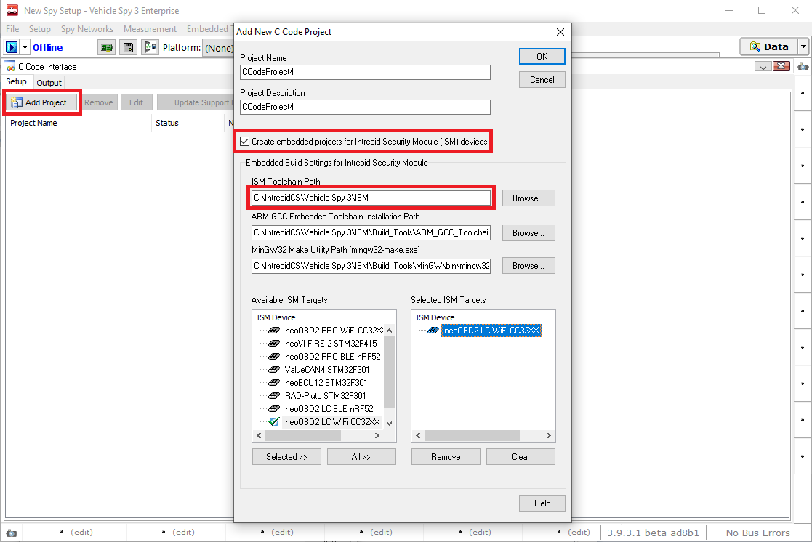
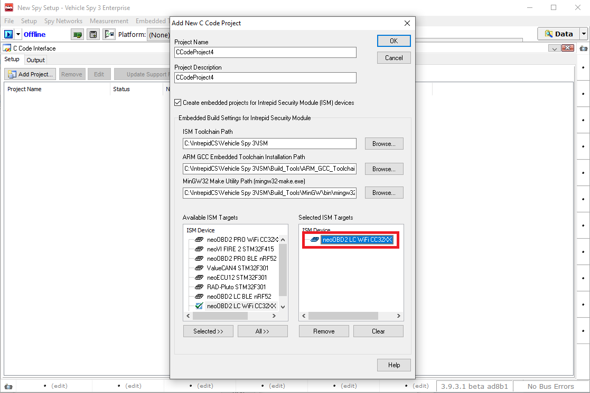
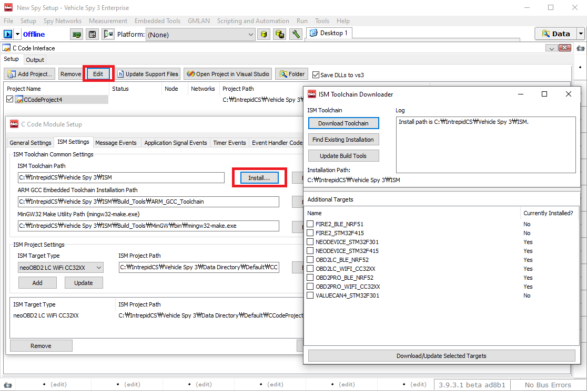
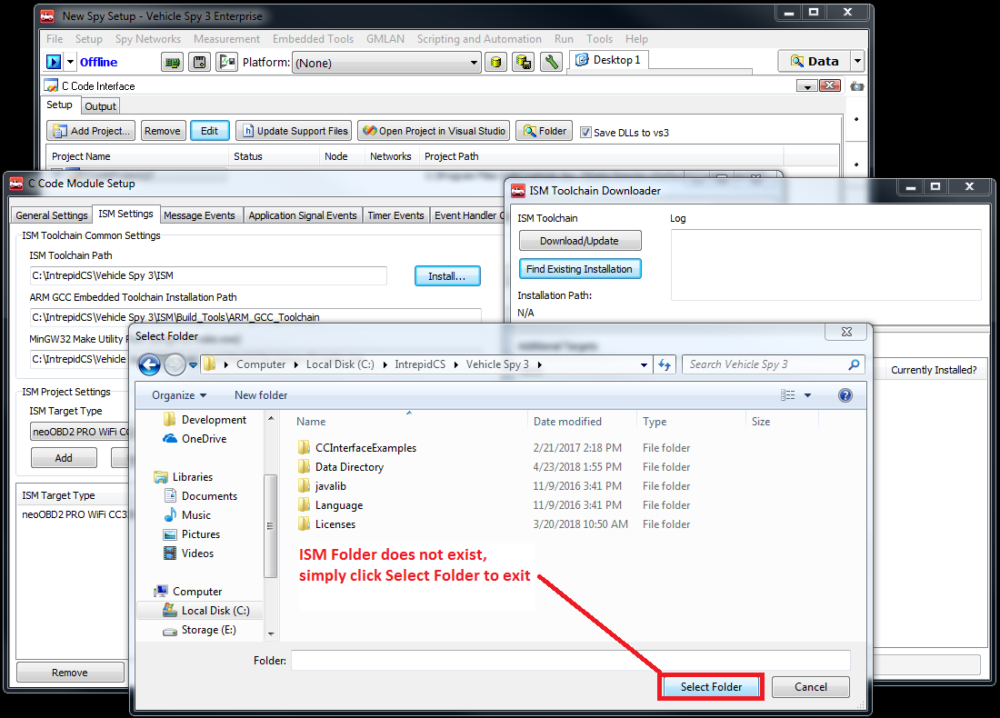
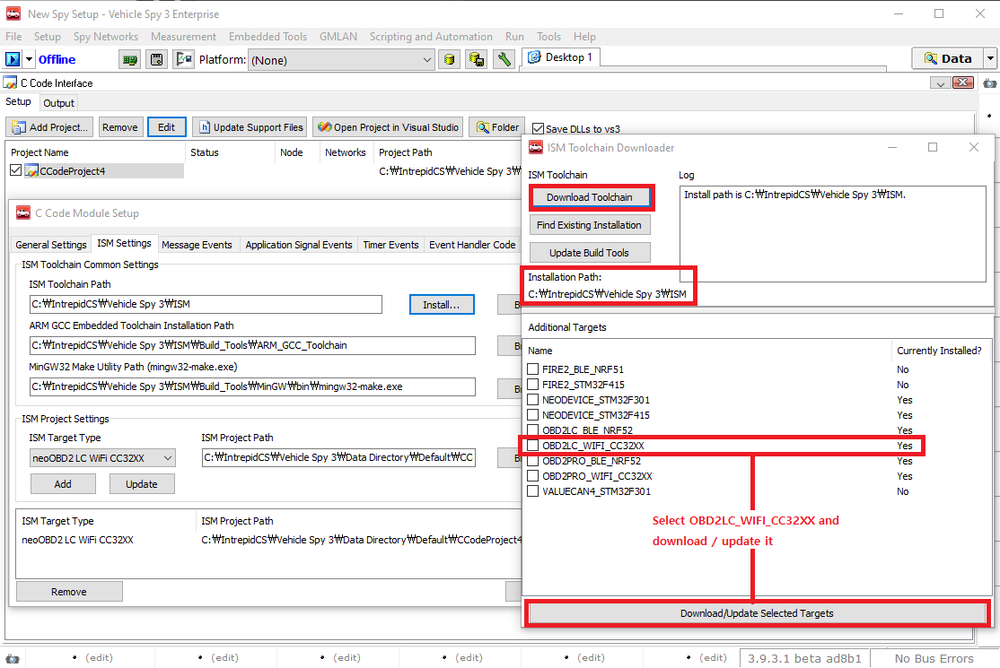

# Getting Started with Wi-Fi Development on neoOBD2 DEV

## Prerequisites

**Before proceeding further, please make sure you have completed the neoOBD2 DEV Hardware setup guide** - [click here](OBD2DEV_HW_SETUP_GUIDE.md).
 
Required Hardware:

1. neoOBD2 DEV
2. neoOBD2 SIM (Optional / highly recommended)
3. USB-A to USB-C USB 2.0 or 3.1 Cable
4. USB-A to Micro-B USB 2.0 Cable
	
Required Software:

1. **[neoOBD2 SDK](#neoobd2_sdk_install)**

    The neoOBD2 SDK is a collection of precompiled static libraries from Intrepid Control Systems and third-party SDKs such as Amazon FreeRTOS, TI CC32XX SDK, and Nordic nRF5 SDK that allow embedded developers to create IoT applications with full access to vehicle networks supported by compatible neoOBD2 family of adaptors including CAN/CANFD, LIN, and Ethernet.
    
    The SDK comes with ready to build CCS sample projects that leverage Intrepid Security Module (ISM) library, [TI CC32XX SDK](http://www.ti.com/tool/download/SIMPLELINK-CC32XX-SDK), [Amazon FreeRTOS](https://aws.amazon.com/freertos/), and [TI Simplelink CC32XX plugin for AWS IoT](http://www.ti.com/tool/download/SIMPLELINK-CC32XX-PLUGIN-FOR-AWSIOT) with connectivity support for [AWS IoT Core](https://aws.amazon.com/iot-core/).

2. **[Microsoft Visual Studio - Optional](#vs_install)**

    The C Code Interface feature in Vehicle Spy Enterprise generates a Visual Studio project containing source and header files that already integrate the ISM libraries for neoOBD2 DEV. Developers can take the generated C codes along with the ISM library and import them into their CC32XX and nRF52 projects to add the ability to access vehicle networks supported by neoOBD2 DEV.

    [Microsoft Visual Studio](https://www.visualstudio.com/downloads/) Community, Professional, or Enterprise edition is required. Microsoft Visual Studio version 2010 or higher is required.

3. **[Intrepid Security Module (ISM) Toolchain](#ism_toolchain_install)**

    The Intrepid Security Module (ISM) is a precompiled static library for compatible embedded microprocessors in Intrepid vehicle network adaptors, which allow the applications running on the microprocessors to access vehicle network data. For neoOBD2 DEV, these microprocessors include the ARM Cortex M4 application processors in the TI CC32XX Wi-Fi and Nordic nRF52 BLE modules. The library allows CAN/CANFD, LIN, and Ethernet messages to be easily constructed from code and transmitted on a live bus with a single API function call. The library also allows you to setup callbacks in code for vehicle network messages you want to capture. This can be done by configuring those messages in Vehicle Spy Enterprise using the C Code Interface.

    The Intrepid Security Module (ISM) Toolchain is a collection of software tools and third-party SDKs that allow you to build embedded applications for ISM-compatible microprocessors. The toolchain is consisted of ARM GCC toolchain, GNU Make tool, and ISM Builder tool which are capable of generating GNU Makefiles to build embedded binaries. For neoOBD2 DEV, these microprocessors include the ARM Cortex M4 applications processors in the TI CC32XX Wi-Fi and Noridc nRF52 BLE modules. The toolchain also comes with vendor Board Support Packages and SDK files needed to build applications.

    The ISM Toolchain is tightly integrated into Vehicle Spy to provide a convenient way to generate a base, skeleton project in Visual Studio with source and header stubs that already integrates the ISM library. Developers can import the ISM library along with the generated source and header files into their CC32XX and nRF52 BLE projects to access vehicle networks supported by neoOBD2 DEV.

    The embedded C Code Interface projects in Visual Studio do not support debugging. Therefore, a full fledged embedded IDE is desired for enhanced development and debugging experience. When developing Wi-Fi applications for CC32XX, the TI Code Composer Studio (CCS) IDE is a popular and recommended choice. Full USB debugging for CC32XX is supported for neoOBD2 DEV from the CCS IDE. All Wi-Fi sample projects provided by the SDK can easily be imported into CCS IDE. Step by step details on developing, building, and deploying projects using the CCS IDE and Vehicle Spy Enterprise is provided with the SDK.

4. **Vehicle Spy Enterprise** - Please complete installation & configuration using the [hardware setup guide](OBD2DEV_HW_SETUP_GUIDE.md)

    [Vehicle Spy Enterprise](https://store.intrepidcs.com/Vehicle-Spy-p/vspy-3-ent.htm) is a single tool for diagnostics, node/ECU simulation, data acquisition, automated testing, and in-vehicle communication networks bus monitoring.
    
    For introduction, tutorials, and documentations on Vehicle Spy Enterprise, please [click here](https://cdn.intrepidcs.net/support/VehicleSpy/vehiclespyhelpdoc.html).

5. **TI Code Composer Studio (CCS) IDE** - Please complete installation & configuration using the [hardware setup guide](OBD2DEV_HW_SETUP_GUIDE.md)

    Details on this integrated development environment from Texas Instruments can be found [here](http://www.ti.com/tool/CCSTUDIO).
	

### Install the neoOBD2 Wi-Fi Application Bootloader

Before starting the Wi-Fi development with neoOBD2 DEV, please ensure that the onboard CC3235SF Wi-Fi chip is running the Intrepid Wi-Fi application bootloader. In order to use Vehicle Spy Enterprise to program your Wi-Fi application on the neoOBD2 DEV, the neoOBD2 application bootloader must be flashed on the CC3235SF. When flashed properly, the bootloader will execute on reset. The execution of the application bootloader is indicated by blinking orange LED as shown in the image below. 

The task of the bootloader is to wait for the Intrepid's proprietary main CPU on the neoOBD2 DEV to validate the existence of bootable application image on the CC3235SF. If found and validated, the main CPU will prompt the CC3235SF to execute the application and pass any information tha the CC3235SF application needs to facilitate the vehicle network data access.

By default, the neoOBD2 DEV ships with the application bootloader pre-flashed on the CC3235SF as the default 'mcuimage.bin' which the ROM bootloader executes on chip reset. The binary is signed using the Intrepid code signing private key. The authenticity of the signature is validated by the CC3235SF using the certificates that are present on the SFLASH up to the root CA.

If the application bootloader has been erased during the development process, you will need to flash it again. For development and prototyping purposes, you may use the dummy keys and certificates provided by TI in the CC32XX SDK. But it is recommended that you use your own root CA certificate, intermediate code signing certificate, and device certificate with matching private key to sign and flash the bootloader binary as the default 'mcuimage.bin'. For a full guide on how to flash a signed binary into the CC3235SF, please refer to the following guide provided by TI - [Simplelink Wi-Fi Certificates Handling](http://www.ti.com/lit/ug/swpu332a/swpu332a.pdf).

The application bootloader binary is provided in the neoOBD2 SDK under demos\intrepid\neoobd2_dev\wifi\app_bl.

### Install neoOBD2 SDK

Using git, clone the neoOBD2 SDK from [GitHub](https://github.com/intrepidcs/neoobd2_sdk).

### Install Microsoft Visual Studio (Optional)

[Microsoft Visual Studio](https://www.visualstudio.com/downloads) Community, Professional, or Enterprise editions are supported. Microsoft Visual Studio version 2010 or higher is required.

Microsoft Visual Studio is not required for Wi-Fi development, but may be useful for testing simple C Code Interface applications on the Wi-Fi module that use ISM library.

### Install Intrepid Security Module (ISM) Toolchain for Wi-Fi

1. Open Vehicle Spy Enterprise. Select **Scripting and Automation** from the top menu and select **C Code Interface**. 

2. Click the **Add Project** button and select **New Project...**. Click the **Create embedded projects for Intrepid Security Module (ISM) devices** check box to inflate additional options. The **ISM Toolchain Path** will automatically point to the ISM folder at the working directory of Vehicle Spy Enterprise. This must be configured as \<drive>:\IntrepidCS\Vehicle Spy 3\ISM. \<drive> is the drive where Vehicle Spy Enterprise is installed.

    

3. Select **neoOBD2 DEV WiFi CC32XX** from the list of **Available ISM Targets**. Click the **OK** button to save and close the view. If you have Microsoft Visual Studio installed, Vehicle Spy will automatically open the generated project in Visual Studio.

    

4. Go back to the **C Code Interface** view. From the top menu, click the **Edit** button to open the **C Code Module Setup** view. Navigate to the **ISM Settings** view and click the **Install…** button to open the **ISM Toolchain Downloader**. 

    

5. **IMPORTANT: YOU MUST set the installation path of the ISM Toolchain to \<drive>:\IntrepidCS\Vehicle Spy 3\ISM.** \<drive> is the drive where Vehicle Spy Enterprise is installed. This is required because \<drive>:\IntrepidCS\Vehicle Spy 3 is considered as a safe area in your PC for Vehicle Spy to access various resources. To do this, click the **Find Existing Installation** button and navigate to the path. Then perform one of the following:

* **If you do not have the ISM folder** under \<drive>:\IntrepidCS\Vehicle Spy 3, that signifies that ISM Toolchain has never been installed on your PC. If this is the case, keep the path set at \<drive>:\IntrepidCS\Vehicle Spy 3 and click the **Download/Update** button to begin the installation process. When the installation process is completed, you will see that the **ISM folder** is created. Next, select the **OBD2DEV_WIFI_CC32XX** from the populated list of targets and click the **Download/Update Selected Targets** button located on the bottom of the view. Doing so will download the support files needed to build Wi-Fi applications - the download process can take a few minutes to complete.

    

* **If you have the ISM folder** under \<drive>:\IntrepidCS\Vehicle Spy 3, that signifies that ISM Toolchain has already been installed on your PC. If this is the case, navigate inside the ISM folder and click the **Select Folder** button to exit the view. Then a list of **Additional Targets** will be populated. Select the **OBD2DEV_WIFI_CC32XX** from the list and click the **Download/Update Selected Targets** button located on the bottom of the view. Doing so will update the support files needed to build Wi-Fi applications - the download process can take a few minutes to complete.

    

    

## Results

By completing this guide and the [Hardware Setup Guide](OBD2DEV_HW_SETUP_GUIDE.md) for neoOBD2 DEV, you are ready to start developing ARM Cortex M4 applications for the CC3235SF Wi-Fi module on neoOBD2 DEV that leverage ISM library.

## What's Next?

Please use this step-by-step guide to start building your first automotive Wi-Fi IoT application for neoOBD2 DEV. The guide walks through a TI Simplelink AWS IoT Plugin sample project provided in the SDK. This sample application connects to AWS IoT Core and transmits classical CAN 2.0 traffic - **[Getting started with your first Wi-Fi application for neoOBD2 DEV](OBD2DEV_WIFI_DEVELOP_FIRST_IOT_APP_GUIDE.md)**
