# Getting Started with your first BLE Application for neoOBD2 PRO

This guide provides a step-by-step guide on creating, debugging, and deploying a sample ready-to-build nrf52832 BLE application for neoOBD2 PRO. This sample project is included in the SDK under neoobd2_sdk/demos/intrepid/ble/nrf5_sdk/examples/ble_peripheral/ble_app_template/obd2pro/s132. The application is based on the "ble_app_template" sample project provided in the Nordic nRF5 SDK. This sample BLE peripheral application sends out BLE advertising packets periodically to BLE central devices that are scanning for peripherals to connect to. In addition to advertising and accepting BLE connection, the application transmits a classical CAN message on the HSCAN1 network of the neoOBD2 PRO using the Intrepid Secure Module (ISM) software API.

When the sample application is programmed into the nrf52832 BLE processor, the neoOBD2 PRO will perform the following:

* Initialize and enable the nrf52832 subsystem
* Start BLE advertising and accept connection from a BLE central device
* Create and start a task that interacts with the ISM library and processes both transmitted and received CAN messages
* Transmits a CAN message at a specified rate

## Prerequisites

### Required Hardware:
* neoOBD2 PRO
* neoOBD2 SIM (Optional)
* Dual USB A & USB C Cable

### Required Software:
* neoOBD2 SDK
* [nRF52 DK](https://www.nordicsemi.com/eng/Products/Bluetooth-low-energy/nRF52-DK). (Recommended for testing)
* [nRF Connect for Desktop](https://www.nordicsemi.com/Software-and-Tools/Development-Tools/nRF-Connect-for-desktop) or nRF Connect for mobile available from Google Play on Android and App Store for iPhone. (Recommended for testing)
* Vehicle Spy Professional

	[Vehicle Spy Professional](http://store.intrepidcs.com/Vehicle-Spy-p/vspy-3-pro.htm) is a single tool for diagnostics, node/ECU simulation, data acquisition, automated testing, and in-vehicle communication networks bus monitoring.
    
	For introduction, tutorials, and documentations on Vehicle Spy Professional, please [click here](https://cdn.intrepidcs.net/support/VehicleSpy/vehiclespyhelpdoc.html).

* Embedded IDE for ARM with DAPLINK support - Please refer to the [hardware setup guide](OBD2PRO_HW_SETUP_GUIDE.md) for recommended IDE

	An embedded IDE for ARM with support for ARM MBED DAPLINK is required for development with nrf52832 in neoOBD2 PRO. This guide is based on [CrossWorks for ARM](https://www.rowley.co.uk/arm/index.htm) by Rowley.

## Application, Hardware, and Cable Overview

The following diagram illustrates how applications and hardware relate to each other in this development paradigm.

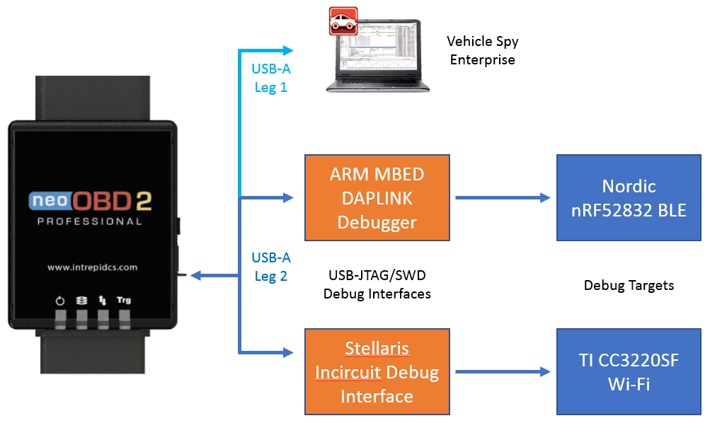

## Import the Sample Project into CrossWorks for ARM

This guide is based on the CrossWorks for ARM IDE by Rowley. Download and install the IDE from [here](https://www.rowley.co.uk/arm/index.htm).

1. Navigate to the ble_app_template project directory under neoobd2_sdk/demos/intrepid/ble/nrf5_sdk/examples/ble_peripheral/ble_app_template/obd2pro/s132/xworks. Double click the "ble_app_template_obd2pro_s132.hzp" to open the project in CrossWorks.

2. The sample project is ready to be built. Press **F7** or go to **Build -> build ble_app_template_obd2pro_s132"** to build the project.

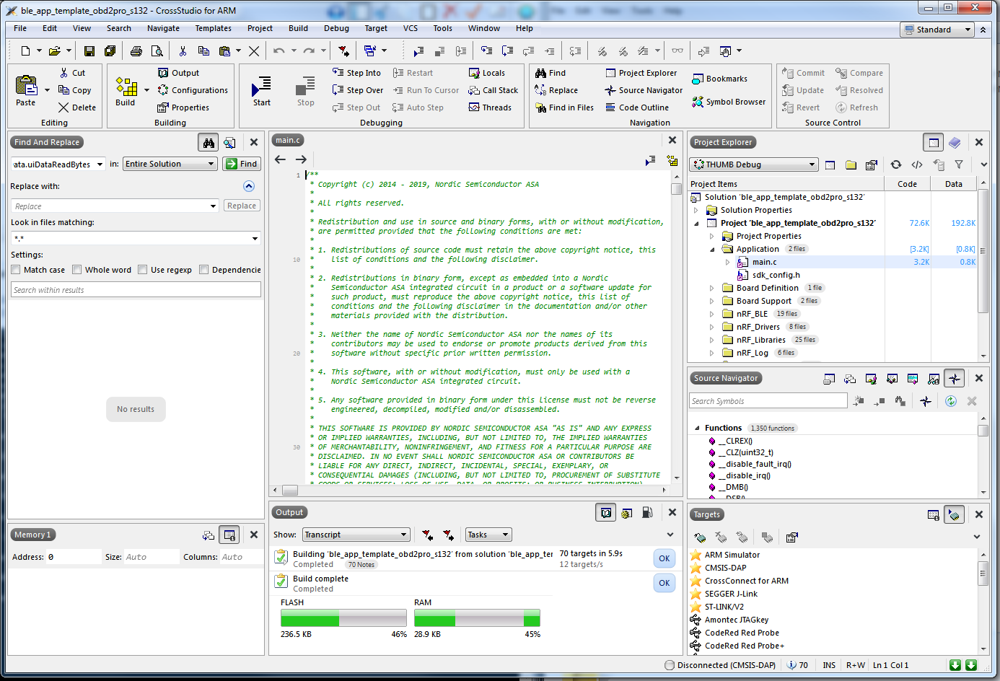

## Importing auto-generated ISM API codes from Vehicle Spy Enterprise

The ISM library (obd2pro_ble_nrf52_ism.a) and a set of auto-generated ISM source files (obd2pro_ble_nrf52.c, obd2pro_ble_nrf52.h, and SpyCCode.c) from Vehicle Spy Enterprise are the software components that grant the code running on nrf52832 transmit and receive access to data over the vehicle networks supported by neoOBD2 PRO (CAN/CANFD, LIN, and KLINE).

Although the ble_app_template sample comes with those files already integrated in the project, please follow this guide to learn how to generate and import them as they are essential components of BLE application development with neoOBD2 PRO.

1. Open Vehicle Spy Enterprise. Go to the **Scripting and Automation** menu and select **C Code Interface**.

2. Click **Add Project...** button and select **New Project...**

3. Click the **Create embedded projects for Intrepid Security Module (ISM) devices** checkbox to inflate additional view.

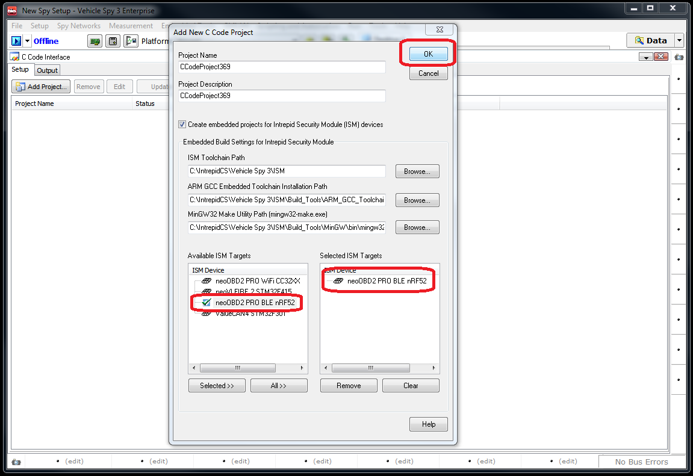

4. Select **neoOBD2 PRO BLE nRF52** from the list of available ISM targets and add it to the selected ISM targets list. Click OK button to generate ISM source files. Note that Visual Studio will open if you have Visual Studio installed on your PC.

5. Go back to the C Code Interface view. Click the **Folder** button which will open up a file explorer in the root directory of the generated C Code Project.

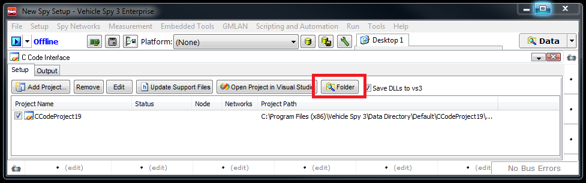

6. **IMPORTANT**: Before proceeding further, save the Vehicle Spy Enterprise project (.vs3) by going to **File** on top menu and selecting **Save**. The saved .vs3 project will be used later to program the completed application into the nrf52832 in neoOBD2 PRO.

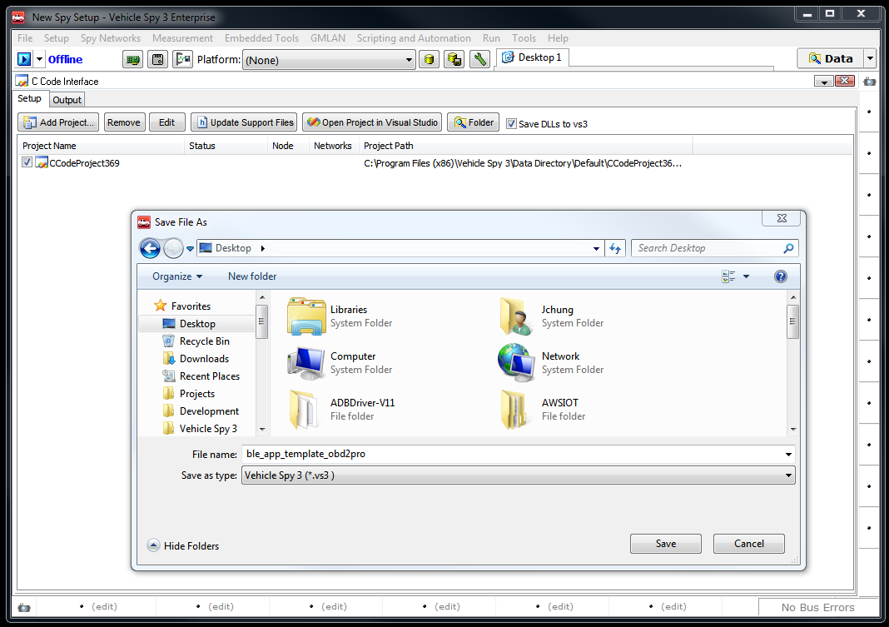

7. Copy the **SpyCCode.c** file and overwrite the one located inside the **ble_app_template folder** of the sample project in CrossWorks.

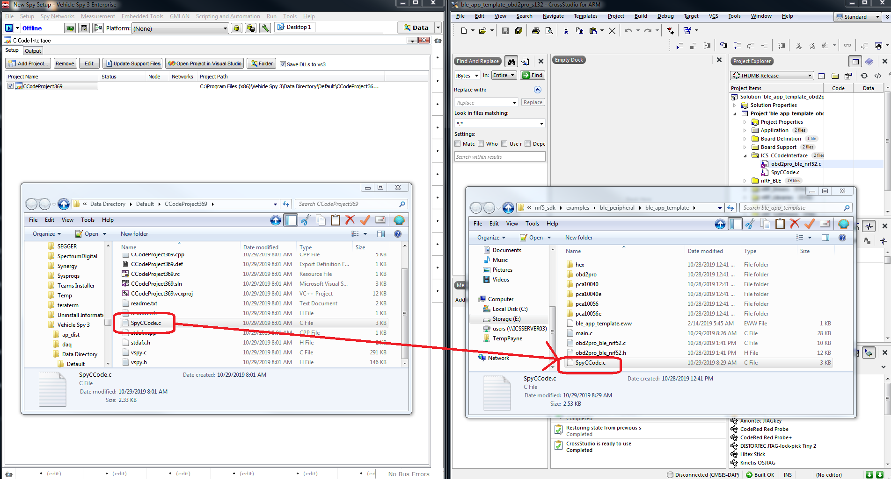

You may need to fix up **SpyCCode.c** so that **obd2pro_ble_nrf52.h** is included properly.

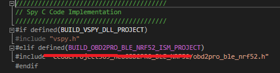

8. Go back to the file explorer. Open the **ProjectName_neoOBD2PRO_BLE_NRF52** folder. Copy **obd2pro_ble_nrf52.c** and **obd2pro_ble_nrf52.h** files and overwrite the one located inside the **ble_app_template folder** of the aws-mqtt sample project in CrossWorks.

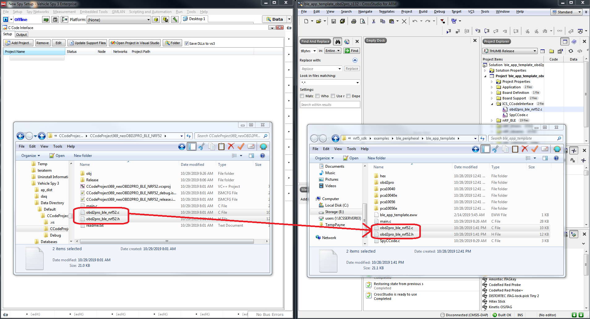

## Debugging Your Application on the neoOBD2 PRO

1. First, we need to program a CoreMini binary from Vehicle Spy Enterprise which will facilitate the Intrepid Secure Module (ISM) API. A CoreMini binary needs to be running in neoOBD2 PRO for your BLE application to interface to vehicle network drivers.

2. Connect the neoOBD2 PRO to your PC using the provided Dual USB-A to USB-C cable. Ensure 
the neoOBD2 PRO mounts in Windows as storage device **DAPLINK**. If your neoOBD2 PRO mounts as **CRP DISABLED** you must program the DAPLINK firmware. Open the CRP DISABLED drive and delete the firmware.bin file. Then, drag-and-drop the **lpc11u35_nrf52832_mdk_if_crc_0245.bin** file from neoobd2_sdk/demos/intrepid/ble/daplink into the CRP DISABLED drive. Power cycle the neoOBD2 PRO and your Windows should now mount neoOBD2 PRO as **DAPLINK**.

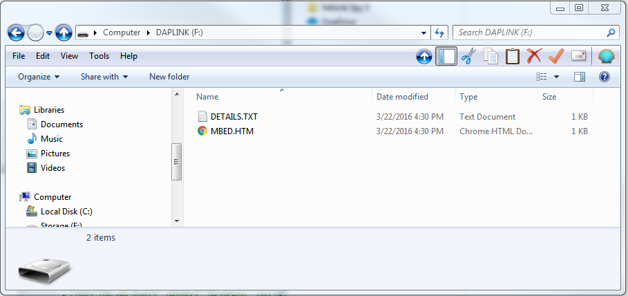

3. Open Vehicle Spy Enterprise. Verify your neoOBD2 PRO appears on the bootom right corner of the logon screen.

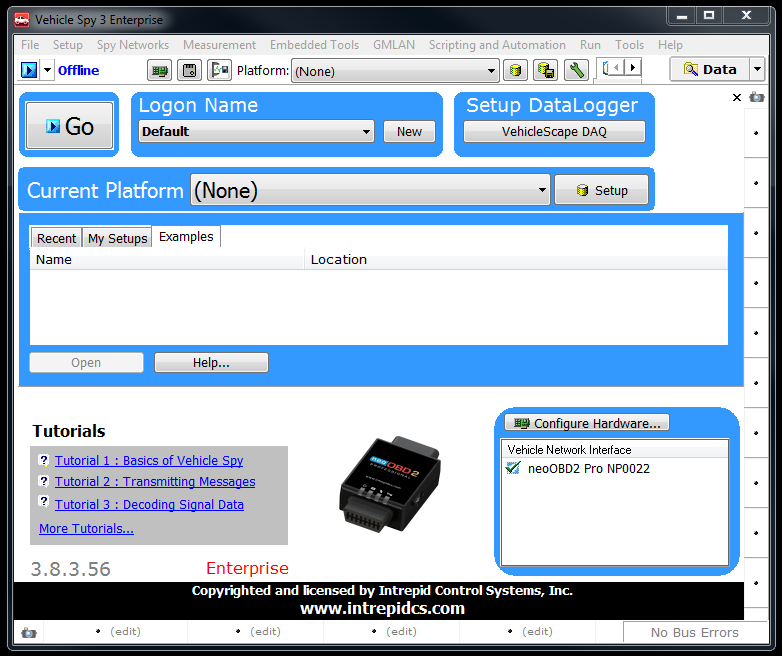

4.  Go to CoreMini Console by selecting **Tools -> CoreMini Console**. Click the **Send** button to program the CoreMini binary to your connected neoOBD2 PRO. Verify the left-most LED on your neoOBD2 PRO blinking in purple, which indicates CoreMini binary is running.

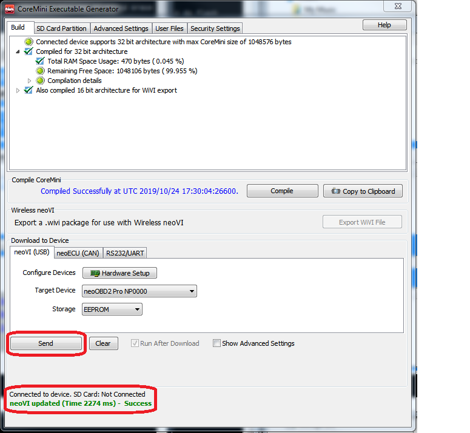

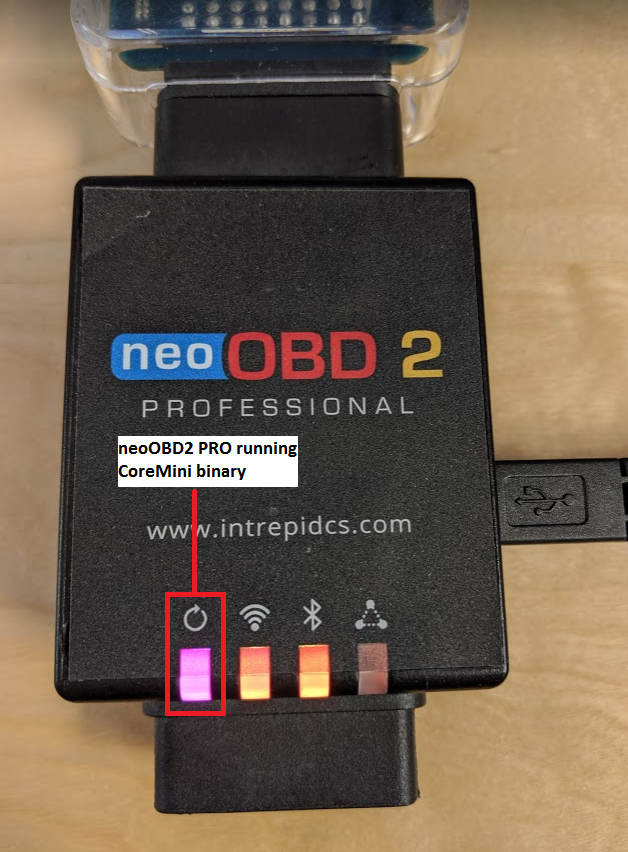

5. Go back to CrossWorks. You can now connect to **CMSIS-DAP** to program and debug your application through DAPLINK. Do this by selecting CMSIS-DAP from **Target->Connect->CMSIS-DAP**.

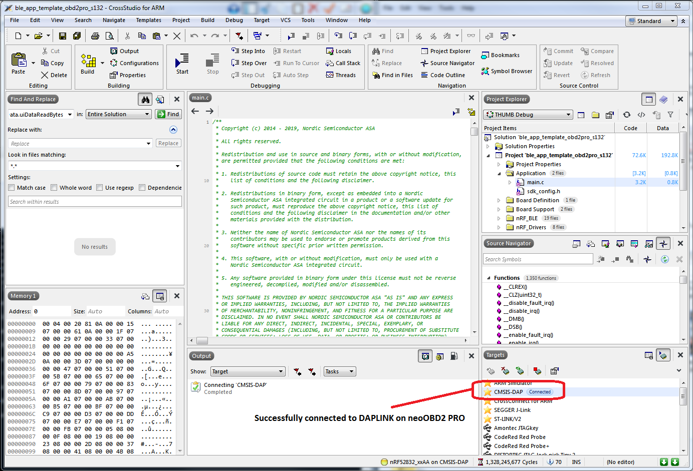

6. Now that you are connected to the DAPLINK debugger on neoOBD2 PRO, you can program and execute the ble_app_template application in debug mode. Press **F5** or go to **Build->Build and Debug** to start debugging.

7. CrossWorks should breakpoint at the entry of the main() function. Press **F5** or go to **Debug -> Go** to resume the program execution.

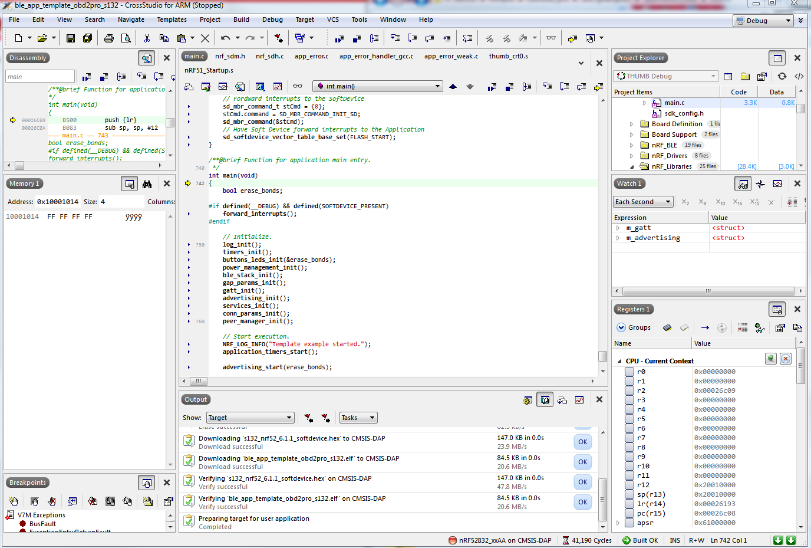

8. Try scanning Bluetooth devices from your Bluetooth-enabled device such as a smart phone or a laptop. You should see neoOBD2 PRO in your list of available Bluetooth devices for connection. The screenshow below shows the neoOBD2 PRO discovered by a nRF-DK PCA10056 development board using the nRF Connect software.

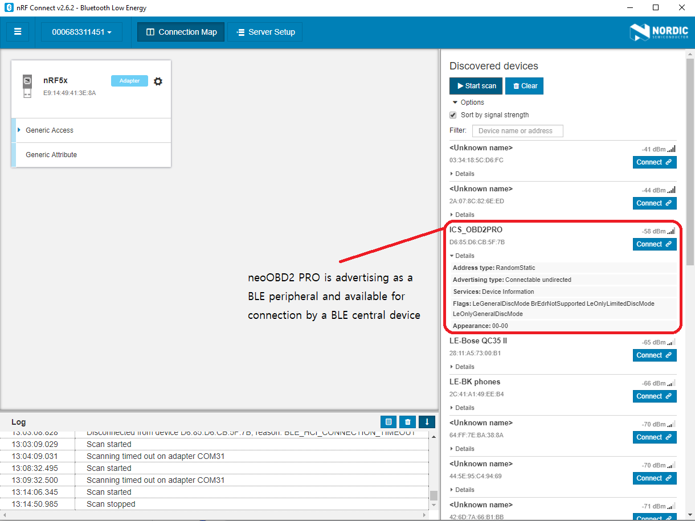

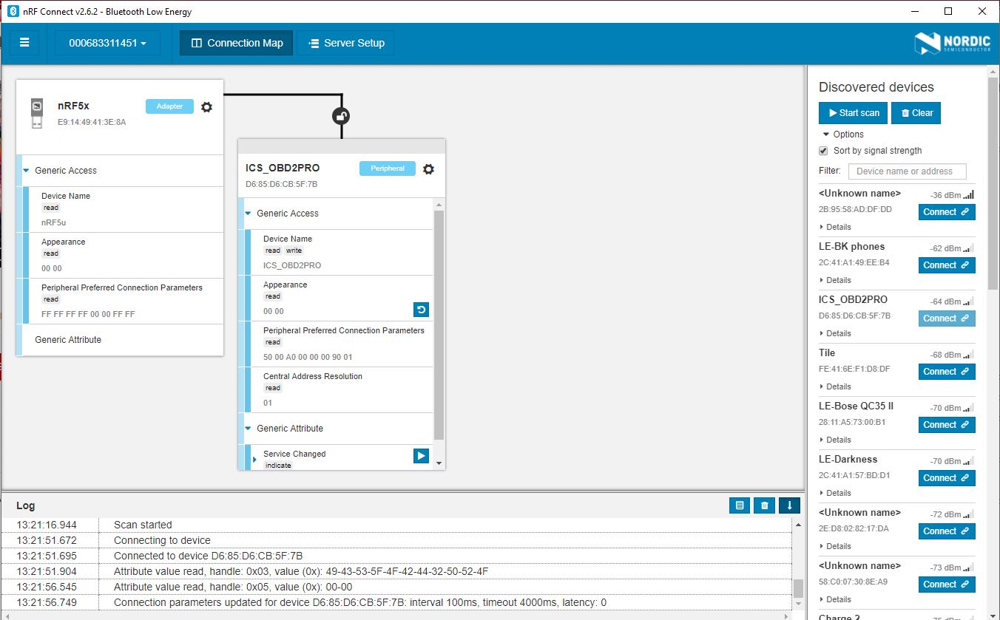

9. Now that we have verified the BLE connection, let's see what is happening on the CAN bus. If you open the **SpyCCode.c** source file from the CrossWorks project, you should see a function called Spy_Everyloop() that implements a CAN message being transmitted every 100 milliseconds with ARBID 0x111.

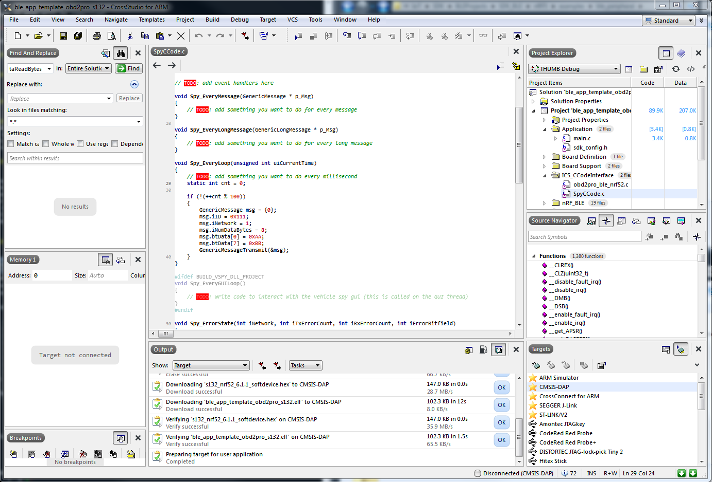

10. Open Vehicle Spy Enterprise and Go Online to verify that your neoOBD2 PRO is transmitting the ARBID 0x111 CAN message on HSCAN1 channel.

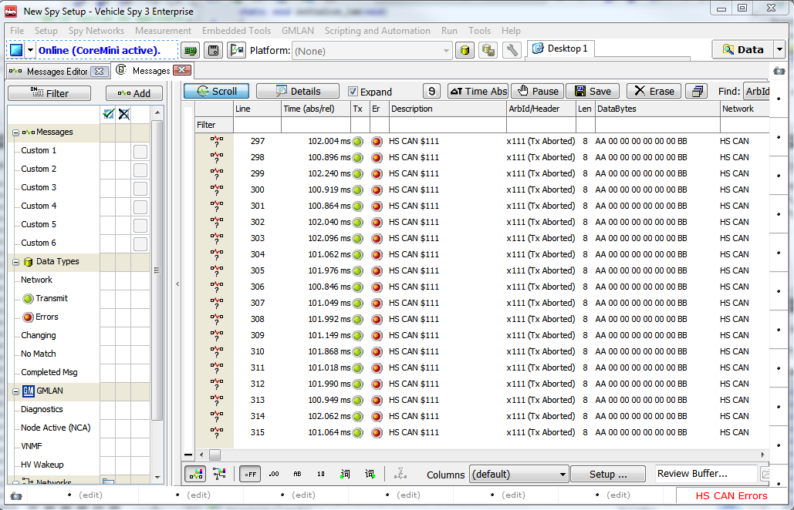

## Programming the Application into neoOBD2 PRO

Once your BLE program is ready to be deployed in neoOBD2 PRO, you can use Vehicle Spy Enterprise to do so. Let's try flashing the output binary generated by the **ble_app_template** project on your neoOBD2 PRO.

Before proceeding further, ensure nrf52832 in your neoOBD2 PRO is programmed with the Intrepid application bootloader. Refer to the **Using pyOCD to flash the Intrepid BLE Application Bootloader** section in the [hardware setup guide](OBD2PRO_HW_SETUP_GUIDE_BLE.md) to ensure the bootloader is programmed. The presence of the bootloader on your neoOBD2 PRO is indicated by the Bluetooth LED blinking in orange.

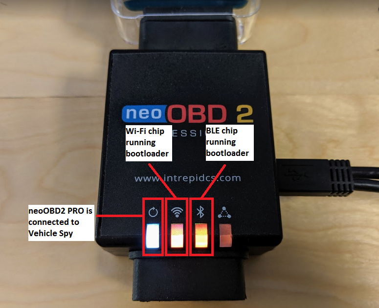

The Intrepid application bootloader running on the nrf52832 allows Vehicle Spy to program your BLE application binary down to it. If the application bootloader detects a valid application in the nrf52832 FLASH, it will load it into its internal FLASH and begin execution. Otherwise, the application bootloader will wait indefinitely for Vehicle Spy to send a valid application. 

1. First, open Vehicle Spy Enterprise and go to **Scripting and Automation -> C Code Interface**.

2. Click Add **Add Project -> New Project...**.

3. Click the **Create embedded projects for Intrepid Security Module (ISM) devices**. Then, double clikc on the **neoOBD2 PRO BLE nRF52** to select the BLE chip on neoOBD2 PRO. Click the **OK** button to generate an Embedded C Code Interface project. If you have Microsoft Visual Studio installed, a project will be created and automatically open in Visual Studio. The Visual Studio project is used for legacy C Code Interface development in Vehicle Spy, you can ignore it.

4. Click the **Folder** button and navigate to the root directory of the neoOBD2 PRO BLE project. Create a new folder named **Release**.

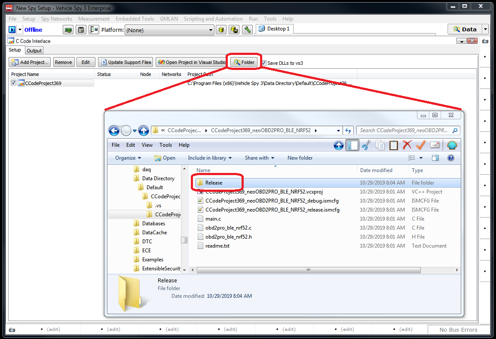

5. Now navigate to the **ble_app_template_obd2pro_s132** output directory. There should be a .bin file called **obd2pro_ble.bin**. This file is generated by the **merge.bat** batch script. The batch script concatenates the Nordic s132 SoftDevice binary that comes with the nRF5 SDK and the ble_app_template application into the obd2pro_ble.bin file. This concetenation is done so that the Intrepid applciation bootloader can program the nrf52832 FLASH in one go and also ensure the correct version of SoftDevice is used.

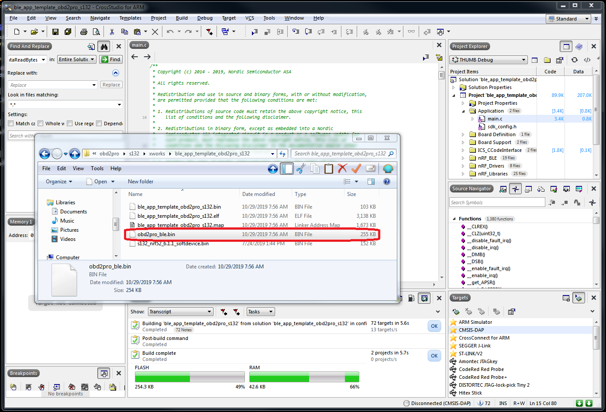

6. Copy the generated **obd2pro_ble.bin** and paste it into the **Release** folder created in step 4.

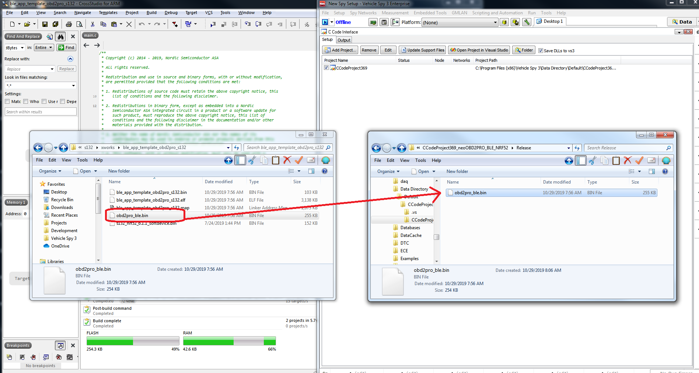

7. Go back to Vehicle Spy Enterprise. Go to **Tools** from the top menu and select **CoreMini Console**. This will open a utility you can use to program the neoOBD2 PRO. Press the **Clear** button to clean the neoOBD2 PRO first.

8. Next, press the **Send** button to program the application into neoOBD2 PRO. Make sure the status message **Sending CCIF Binary Data** appears followed by a Success message. If **Sending CCIF Binary Data** message does not appear during the programming process, go back to step 6 in the previous section and **make sure the obd2pro_ble is correctly placed inside the 'Release' folder**. The folder must be named **'Release'**.

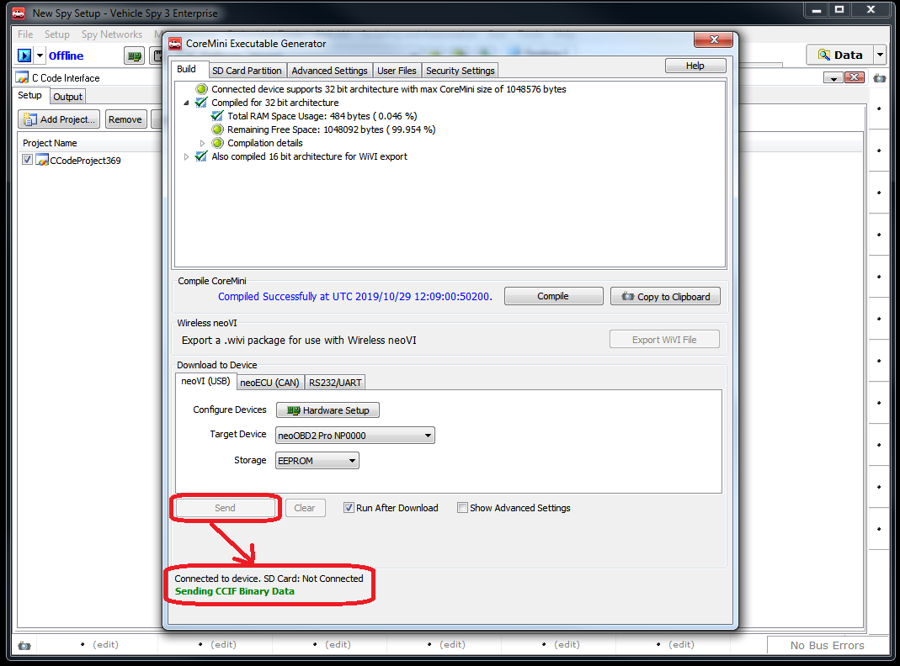

9. Power cycle your neoOBD2 PRO. Wait for a few seconds until the application starts executing. When the application is executing, the left-most LED should be blinking in purple and the Bluetooth status LED should be blinking in white. The right-most LED should be blinking in Green, indicating that a message is being transmitted by your neoOBD2 PRO.

## What's Next?

The ble_app_template sample project only implements the basic advertising feature of a BLE peripheral device. The following guides from Nordic are excellent training material for those who want to extend the template project with custom advertising data, custom BLE services and characteristics:

* **[Bluetooth low energy Advertising, a beginner's tutorial](https://devzone.nordicsemi.com/nordic/short-range-guides/b/bluetooth-low-energy/posts/ble-advertising-a-beginners-tutorial)**.

* **[Bluetooth low energy Services, a beginner's tutorial](https://devzone.nordicsemi.com/nordic/short-range-guides/b/bluetooth-low-energy/posts/ble-services-a-beginners-tutorial)**.

* **[Bluetooth low energy Characteristics, a beginner's tutorial](https://devzone.nordicsemi.com/nordic/short-range-guides/b/bluetooth-low-energy/posts/ble-characteristics-a-beginners-tutorial)**.

Now that you are able to import, debug, and program a sample project: 

* Learn **[how to transmit (Tx) vehicle network messages (CAN/CANFD, LIN, Ethernet) from your program](OBD2PRO_ISM_TX_MSG_GUIDE.md)**. 

* Learn **[how to receive (Rx) vehicle network messages (CAN/CANFD, LIN, Ethernet) from your program](OBD2PRO_ISM_RX_MSG_GUIDE.md)**.
