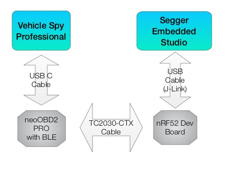
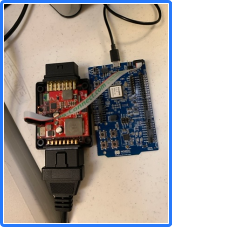
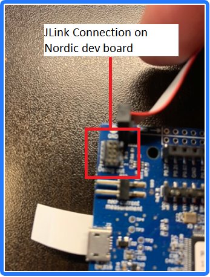
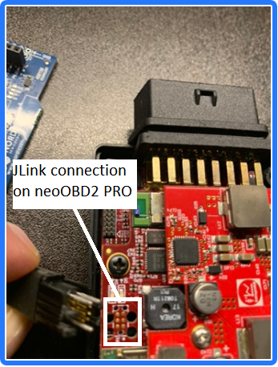
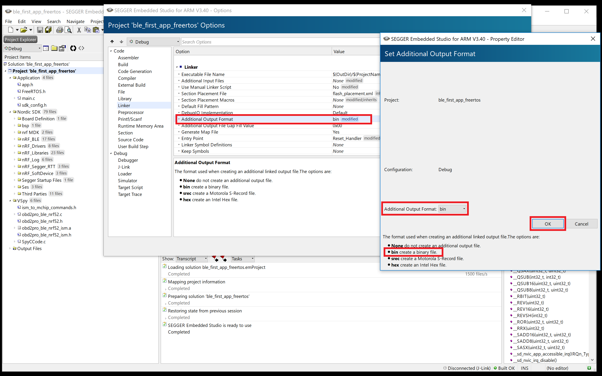
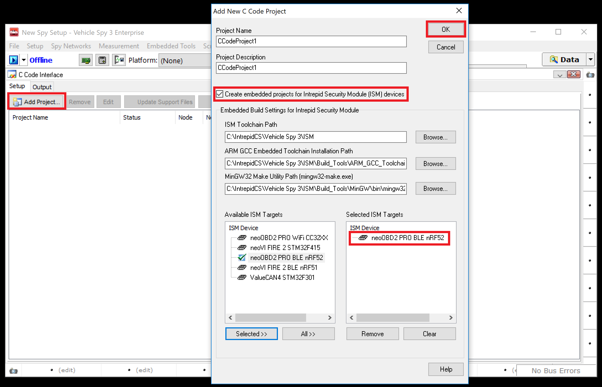

# Getting Started with your first BLE Application for neoOBD2 PRO

This guide provides a step-by-step guide on creating, debugging, and deploying a sample ready-to-build nRF52 BLE application for neoOBD2 PRO. This sample project is included in the SDK. The application is based on Amazon FreeRTOS. The application runs on the nRF52 in the neoOBD2 PRO and sends a classical CAN message on the HSCAN1 network of the neoOBD2 PRO, and then receives and processes a response from another node on the CAN network. This example does not utilize BLE features, it is only a simple demonstration of how to send and receive CAN messages using the nRF52 and the ISM library. A Vehicle Spy project file (OA_Response.vs3) is provided that can be used to respond to the CAN query message from the neoOBD2 PRO. This will require running a copy of Vehicle Spy with another device that is connected to a desktop CAN network. Alternatively, the project can be modified to send a valid OBD2 query message to an ECU on a vehicle.

When the sample application is programmed into the nRF52 BLE processor, the neoOBD2 PRO will perform the following:

* Initialize and enable the nRF52 subsystem
* Create and start a task that interacts with the ISM library and processes both transmitted and received CAN messages
* Transmits a classical CAN message at a specified rate
* Waits for a response and routes it to a handler function in the application
* Extracts a data value from the response message and displays it in the debug console

## Prerequisites

### Required Hardware:
* neoOBD2 PRO
* Dual USB A & USB C Cable

### Required Software:
* neoOBD2 SDK
* Vehicle Spy Professional

	[Vehicle Spy Professional](http://store.intrepidcs.com/Vehicle-Spy-p/vspy-3-pro.htm) is a single tool for diagnostics, node/ECU simulation, data acquisition, automated testing, and in-vehicle communication networks bus monitoring.
    
	For introduction, tutorials, and documentations on Vehicle Spy Professional, please [click here](https://cdn.intrepidcs.net/support/VehicleSpy/vehiclespyhelpdoc.html).

* Segger Embedded Studio - Please complete installation & configuration using the [hardware setup guide](OBD2PRO_HW_SETUP_GUIDE_BLE.md)

## Application, Hardware, and Cable Overview

The following diagram illustrates how applications and hardware relate to each other in this development paradigm

## Debugging Your Application on the neoOBD2
To debug applications running on the neoOBD2 PRO from within Segger Studio, you will need to acquire the following:

* nRF52 Bluetooth Smart, ANT, 2.4GHz Development Kit (NRF52-DK) by Nordic Semiconductor 
* TC2030-CTX 6-Pin Cable for ARM Cortex  [Order here](http://www.tag-connect.com/TC2030-CTX)
 
### The debugging procedure is as follows:
1. The application you want to debug must already be downloaded and running on the neoOBD2 PRO. You will be attaching the Segger IDE's debugger to the process running in the BLE SoC on the device, using the NRF52-DK dev board as a pass-through device.

**Both boards connected**

 

2. Connect the NRF52-DK board to your computer using the provided USB cable. 
3. Connect one end of the TC2030-CTX 6-pin cable to the 'Debug Out' connector on the NRF52-DK board.

4. Connect the other end to the J-Tag connector on the neoOBD2 PRO

5. In Segger Studio, with the project you want to debug already open, click on the 'Target' menu, and select "Connect J-Link". In the 'Output' window, you should see "Connecting 'J-Link' using 'USB', and below it "Completed".
6. Click on the 'Target' menu and select "Attach Debugger". You should see a debug terminal window and any output that is being generated by the application. You should be able to set and stop on breakpoints within the project and examine variables.

### Note: Do not select "Erase All" from the 'Target' menu while connected to the neoOBD2 PRO. This will erase the boot-loader in the neoOBD2 PRO

## Downloading and Installing the Nordic nRF5 SDK
* Download the Nordic nRF5 SDK, version 15.2.0 from Nordic **Can't find the download for this, only the latest**
* Unzip the SDK to a location on your system. You will need to specify the location the settings for your projects

## Important Project Files
* **SpyCCode.c** - Contains the init_vspy() function that initializes and starts the main application worker thread. It also has callback functions necessary to send the query message on the CAN bus and process the responses.

* **obd2pro_ble_nrf52_ism.a** - The ISM library file that is linked to the application .bin file. It provides the API that allows the application to interact with the vehicle networks on the neoOBD2 PRO.

* **OA_Response.vs3** - A Vehicle Spy project file that is setup to receive the CAN bus queries from the application and send a response message. Open this file in Vehicle Spy and go online with a separate neo Device that is connected to the same CAN network as the neoOBD2 PRO.

* **s132_nrf52_6.1.0_softdevice.bin** - This the soft device file in .bin format. The application binary file is added to the end of this file and downloaded to the neoOBD2 PRO.

* **merge.bat** - This batch file is called as a post-link command. It takes a single input parameter string, either 'Debug' or 'Release',  It contains the following commands:
	
This command will merge the application the softdevice .bin file with the application .bin, and create **output.bin**

	copy /b /y s132_nrf52_6.1.0_softdevice.bin + Output\%1\ble_first_app_freertos.bin Output\%1\output.bin

The next command copies output.bin to the release directory of the Visual Studio project that will be used to download the .bin file to the neoOBD2 PRO. Change the path to match where you created your Visual Studio project:

	copy Output\%1\output.bin "C:\IntrepidCS\Vehicle Spy 3\Data Directory\Default\ble_testing\ble_testing_neoOBD2PRO_BLE_NRF52\Release\output.bin"

**The post-link command can be specified under project settings:**

## Building the Sample Project in Segger Embedded Studio
1. Open Segger Embeded Studio. Go to **File** on the top menu and select **Open Solution**. Navigate to *SDK_PATH*/samples/ble_first_app_freertos, where *SDK_PATH* is the local path where you have downloaded the neoOBD2 SDK. Select **ble_first_app_freertos.emProject** and click **Open**
2. Before building, the location of the Nordic nRF5 SDK must be specified. In the *Project Explorer* windows, right-click on the **Project 'ble_first_app_freertos'** node, then click **Edit Options**. Ensure that the configuration selected is **Debug**. In the 'Search Options' field, type **nordicSDK**. Under the **Build** section, double-click on *Project Macros*. For the macro **nordicSDK** change the value to the path where the Nordic nRF5 SDK is located. Click **OK**. Remember to do this for the **Release** configuration also.
3. You should now be able to build the project. Select **Build** and **Build ble_first_app_freertos**. 

**Note: Segger Studio projects default to creating an application in .hex format. The project we are using has already been changed to produce a .bin file format. For future projects, here is how to change the default setting to hex file format output:**

In the next section, we will use Vehicle Spy and Visual Studio to create a simple C-Code Interface project that will be used to download the Segger application to the neoOBD2 PRO.

## How to Create a Simple ISM BLE Project to Download Segger Applications to a neoOBD2 PRO Using Vehicle Spy
Follow below steps to create a basic application that can be used to download a an application created with Segger Studio to a neoOBD2 PRO. 

For a complete documentation on **Vehicle Spy Enterprise**, please [click here](https://cdn.intrepidcs.net/support/VehicleSpy/vehiclespyhelpdoc.html).

1. Open Vehicle Spy Enterprise. Go to the **Scripting and Automation** menu and select **C Code Interface**. 
2. Click **Add Project...** button and select **New Project...**
3. Click the **Create embedded projects for Intrepid Security Module (ISM) devices** check box to inflate additional view.

4. Select **neoOBD2 PRO BLE nRF52** from the list of available ISM targets and add it to the selected ISM targets list. Click **OK** button to generate ISM source files. Note that Visual Studio will open if you have Visual Studio installed on your PC. You may see a dialog called **Retarget Projects**, indicating that the project needs to be updated to use a newer version of the Windows SDK and Platform Toolset. Click **OK** to update.
5. In Visual Studio, change the configuration to **Release**. From the **Build** menu, select **Rebuild Solution**. 
6. In the Solution Explorer panel, you will see that there are two projects defined in the tree. For example:

When the red high-lighted project **CCodeProject1_neoOBD2PRO_BLE_NRF52** was built, a **Release** directory was created. This is where the Segger Studio project will copy the merged softdevice/application **output.bin** file created by the post-link command. You can open a File Explorer window to it easily by right clicking on the tab for the **main.c** file (high-lighted in red), and selecting **Open Containing Folder**. In the newly opened File Explorer window, double-click on the **Release** folder. 

7. After the output.bin file is copied to this location by the Segger Studio project, rename the extension of .bin file that Visual Studio created to something other than .bin (i.e. .XXX), or delete the file. When downloading the .bin file to the neoOBD2 PRO, Vehicle Spy will look in this directory and try to download the first .bin file it sees. **Output.bin** is the file we want Vehicle Spy to locate first. 

## Programming the Application into neoOBD2 PRO

Once your BLE program is ready to be deployed in neoOBD2 PRO, you can use Vehicle Spy to do so.

The nRF52 BLE module in neoOBD2 PRO is programmed with an application bootloader at production, which allows Vehicle Spy to program an application binary. The application bootloader is always executed first from external secure FLASH. If the application boot-loader detects a valid application in the external FLASH, it will load it into its internal FLASH and begin execution. Otherwise, the application boot-loader will wait indefinitely for Vehicle Spy to send a valid application. 

1. Open the .vs3 project that was created in the previous section. 
2. Go to **Tools** from the top menu and select **CoreMini Console**. This will open a utility you can use to program the neoOBD2 PRO. Press the **Clear** button to clean the neoOBD2 PRO first.

3. Next, press the **Send** button to program the application into neoOBD2 PRO. Make sure the status message **Sending CCIF Binary Data** appears followed by a Success message. If **Sending CCIF Binary Data** message does not appear during the programming process, go back to step 6 in the previous section and **make sure the output.bin is correctly placed inside the 'Release' folder**. The folder must be named **'Release'**.

4. Unplug the Dual USB A & USB C cable to power off the neoOBD2 PRO.
5. Plug in the Dual USB A & USB C cable again to power the neoOBD2 PRO back on. At this point the status LED on neoOBD2 PRO should be blinking in magenta (purple), indicating that the program is running. Whenever a new application is programmed, it takes roughly 20 ~ 30 seconds for the program to execute. An existing application typically takes less than 5 seconds to start executing.

## What's Next?

Now that you are able to import, debug, and program a sample project: 

* Learn **[how to transmit (Tx) vehicle network messages (CAN/CANFD, LIN, Ethernet) from your program](OBD2PRO_ISM_TX_MSG_GUIDE.md)**. 

* Learn **[how to receive (Rx) vehicle network messages (CAN/CANFD, LIN, Ethernet) from your program](OBD2PRO_ISM_RX_MSG_GUIDE.md)**.
