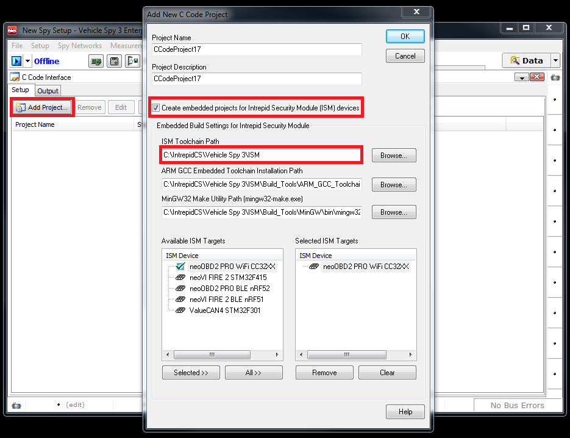
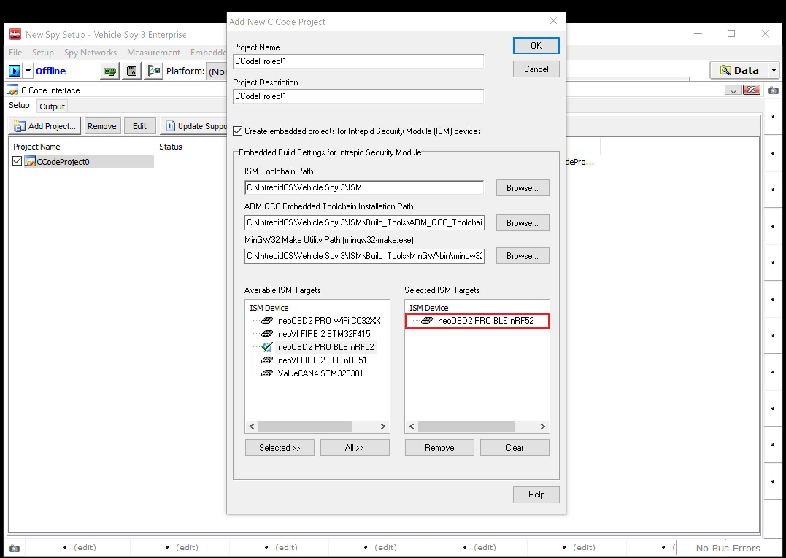
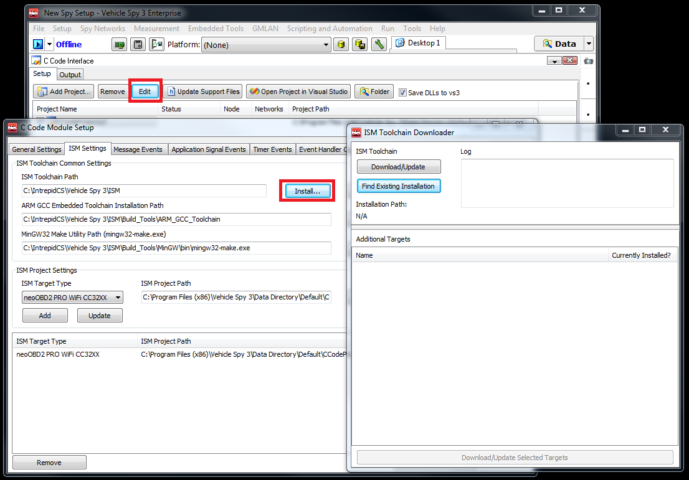
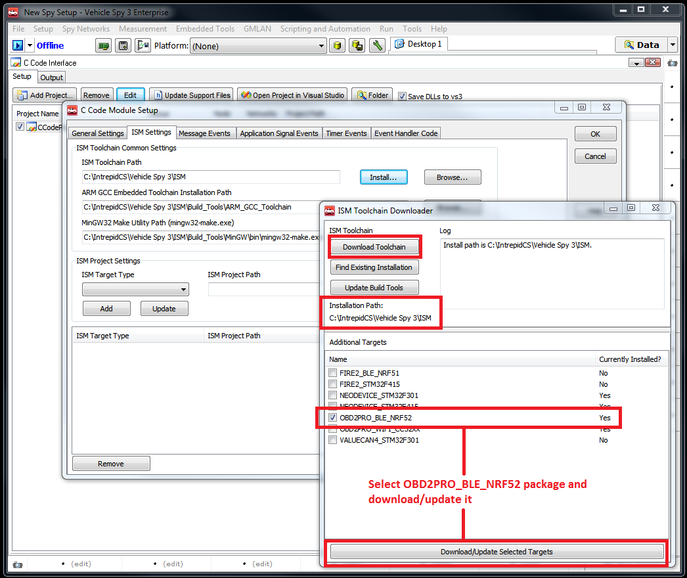
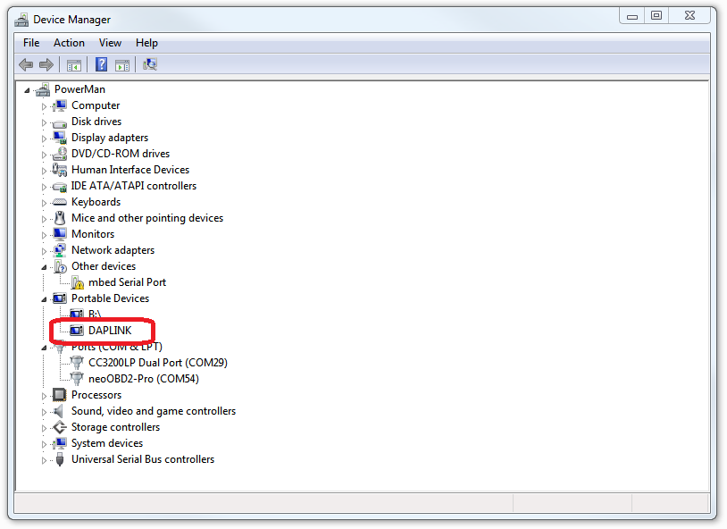
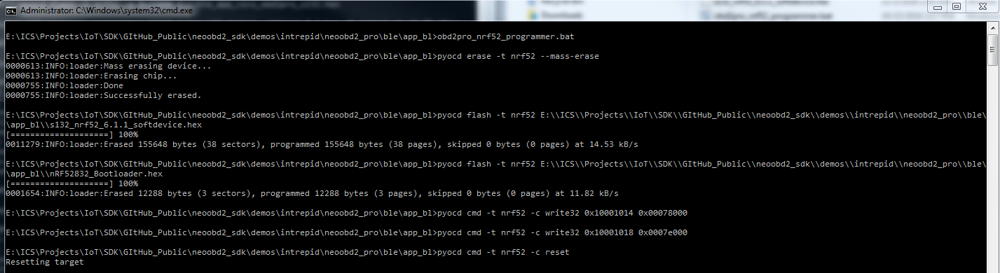
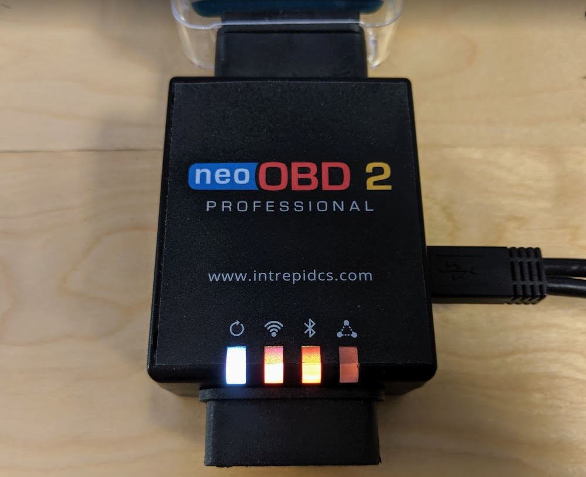

# Getting Started with BLE Development on neoOBD2 PRO

## Prerequisites

**Before proceeding further, please make sure you have completed the neoOBD2 PRO Hardware setup guide** - [click here](OBD2PRO_HW_SETUP_GUIDE.md).

Required Hardware:

1. [neoOBD2 PRO](https://store.intrepidcs.com/neoOBD-2-Pro-p/neoobd2-pro.htm)
2. [neoOBD2 SIM](https://store.intrepidcs.com/neoECU-CHIP-Simulator-p/neoobd2-sim.htm) (Optional)
3. [Dual USB A & USB C cable](https://store.intrepidcs.com/productdetails_popup.asp?productcode=NEOOBD2-PRO-PROG-CABLE)
	
Required Software:

1. **[neoOBD2 SDK](#neoobd2_sdk_install)**

    The neoOBD2 SDK is a collection of precompiled static libraries from Intrepid Control Systems and third-party SDKs such as Amazon FreeRTOS, TI CC3220 SDK, and Nordic nRF5 SDK that allow embedded developers to create IoT applications with full access to vehicle networks supported by compatible neoOBD2 family of adaptors including CAN/CANFD, LIN, and Ethernet.
    
    The SDK comes with ready to build CCS sample projects that leverage Intrepid Security Module (ISM) library, [TI CC3220 SDK](http://www.ti.com/tool/simplelink-cc3220-sdk), and [Amazon FreeRTOS](https://aws.amazon.com/freertos/) with connectivity support for [AWS IoT Core](https://aws.amazon.com/iot-core/) and [AWS Greengrass](https://aws.amazon.com/greengrass/).

2. **[Microsoft Visual Studio - Optional](#vs_install)**

    The C Code Interface feature in Vehicle Spy Enterprise generates a Visual Studio project containing source and header files that already integrate the ISM libraries for neoOBD2 PRO. Developers can take the generated C codes along with the ISM library and import them into their CC3220SF and nRF52 projects to add the ability to access vehicle networks supported by neoOBD2 PRO.

    [Microsoft Visual Studio](https://www.visualstudio.com/downloads/) Community, Professional, or Enterprise edition is required. Microsoft Visual Studio version 2010 or higher is required.

3. **[Intrepid Security Module (ISM) Toolchain](#ism_toolchain_install)**

    The Intrepid Security Module (ISM) is a precompiled static library for compatible embedded microprocessors in Intrepid vehicle network adaptors, which allow the applications running on the microprocessors to access vehicle network data. For neoOBD2 PRO, these microprocessors include the ARM Cortex M4 application processors in the TI CC3220SF Wi-Fi and Nordic nRF52832 BLE modules. The library allows CAN/CANFD, LIN, and Ethernet messages to be easily constructed from code and transmitted on a live bus with a single API function call. The library also allows you to setup callbacks in code for vehicle network messages you want to capture. This can be done by configuring those messages in Vehicle Spy Enterprise using the C Code Interface.

    The Intrepid Security Module (ISM) Toolchain is a collection of software tools and third-party SDKs that allow you to build embedded applications for ISM-compatible microprocessors. The toolchain is consisted of ARM GCC toolchain, GNU Make tool, and ISM Builder tool which are capable of generating GNU Makefiles to build embedded binaries. For neoOBD2 PRO, these microprocessors include the ARM Cortex M4 applications processors in the TI CC3220SF Wi-Fi and Noridc nRF52832 BLE modules. The toolchain also comes with vendor Board Support Packages and SDK files needed to build applications.

    The ISM Toolchain is tightly integrated into Vehicle Spy to provide a convenient way to generate a base, skeleton project in Visual Studio with source and header stubs that already integrates the ISM library. Developers can import the ISM library along with the generated source and header files into their CC3220SF and nRF52 BLE projects to access vehicle networks supported by neoOBD2 PRO.

    The embedded C Code Interface projects in Visual Studio do not support debugging. Therefore, a full fledged embedded IDE is desired for enhanced development and debugging experience. When developing Wi-Fi applications for CC3220SF, the TI Code Composer Studio (CCS) IDE is a popular and recommended choice. Full USB debugging for CC3220SF is supported for neoOBD2 PRO from the CCS IDE. All Wi-Fi sample projects provided by the SDK can easily be imported into CCS IDE. Step by step details on developing, building, and deploying projects using the CCS IDE and Vehicle Spy Enterprise is provided with the SDK.

4. **Vehicle Spy Enterprise** - Please complete installation & configuration using the [hardware setup guide](OBD2PRO_HW_SETUP_GUIDE.md)

    [Vehicle Spy Enterprise](https://store.intrepidcs.com/Vehicle-Spy-p/vspy-3-ent.htm) is a single tool for diagnostics, node/ECU simulation, data acquisition, automated testing, and in-vehicle communication networks bus monitoring.
    
    For introduction, tutorials, and documentations on Vehicle Spy Enterprise, please [click here](https://cdn.intrepidcs.net/support/VehicleSpy/vehiclespyhelpdoc.html).

5. **[pyOCD for flashing the Intrepid BLE Application Bootloader](#flash_ble_app_bootloader)**

    The neoOBD2 PRO features ARM MBED DAPLINK interface for programming and debugging the onboard nRF52832 via USB. We will use pyOCD in this guide to show how the Intrepid BLE application bootloader is programmed into the nRF52832. The bootloader is required for Vehicle Spy Enterprise to program BLE application for release.
    
    pyOCD is available on GitHub [here](https://github.com/mbedmicro/pyOCD)

6. **ARM Embedded IDE** of your choice with support for ARM MBED DAPLINK

    There are several embedded Integrated Development Environment tools that support the ARM MBED DAPLINK (formerly CMSIS-DAP) debug protocol to debug / program Nordic nRF52832. 

    - **Rowley CrossWorks for ARM (Recommended)**
    - ARM KEIL µVision® IDE
    - IAR Embedded Workbench
    - GNU ARM Embedded Toolchain with pyOCD

    Intrepid recommends using [CrossWorks for ARM](https://www.rowley.co.uk/arm/index.htm) from Rowley for BLE development with neoOBD2 PRO. The neoOBD2 SDK provides sample BLE applications in the form of CrossWorks projects. These projects are based on Segger Embedded Studio projects provided by Nordic in their nRF5 SDK.

    Nordic offers an IDE called Segger Embedded Studio to its customers for development with nRF SoC. The nRF5 SDK comes with numerous sample BLE projects that are created using Segger Embedded Studio. What is unique about Segger Embedded Studio is that it is based on an IDE called CrossWorks for ARM by Rowley. In addition to Segger J-Link, CrossWorks supports other debug interfaces including DAPLINK for programming and debugging nRF SOC.

### Install neoOBD2 SDK

Using git, clone the neoOBD2 SDK from [GitHub](https://github.com/intrepidcs/neoobd2_sdk).

### Install Microsoft Visual Studio (Optional)

[Microsoft Visual Studio](https://www.visualstudio.com/downloads) Community, Professional, or Enterprise editions are supported. Microsoft Visual Studio version 2010 or higher is required.

Microsoft Visual Studio is not required for Wi-Fi development, but may be useful for testing simple C Code Interface applications on the Wi-Fi module that use ISM library.

### Install Intrepid Security Module (ISM) Toolchain for BLE

1. Open Vehicle Spy Enterprise. Select **Scripting and Automation** from the top menu and select **C Code Interface**. 

2. Click the **Add Project** button and select **New Project...**. Click the **Create embedded projects for Intrepid Security Module (ISM) devices** check box to inflate additional options. The **ISM Toolchain Path** will automatically point to the ISM folder at the working directory of Vehicle Spy Enterprise. This must be configured as \<drive>:\IntrepidCS\Vehicle Spy 3\ISM. \<drive> is the drive where Vehicle Spy Enterprise is installed.

3. Select **neoOBD2 PRO BLE nRF52** from the list of **Available ISM Targets**. Click the **OK** button to save and close the view. If you have Microsoft Visual Studio installed, Vehicle Spy will automatically open the generated project in Visual Studio.

4. Go back to the **C Code Interface** view. From the top menu, click the **Edit** button to open the **C Code Module Setup** view. Navigate to the **ISM Settings** view and click the **Install…** button to open the **ISM Toolchain Downloader**. 

5. **IMPORTANT: YOU MUST set the installation path of the ISM Toolchain to \<drive>:\IntrepidCS\Vehicle Spy 3\ISM.** \<drive> is the drive where Vehicle Spy Enterprise is installed. This is required because \<drive>:\IntrepidCS\Vehicle Spy 3 is considered as a safe area in your PC for Vehicle Spy to access various resources. To do this, click the **Find Existing Installation** button and navigate to the path. Then perform one of the following:

* **If you do not have the ISM folder** under \<drive>:\IntrepidCS\Vehicle Spy 3, that signifies that ISM Toolchain has never been installed on your PC. If this is the case, keep the path set at \<drive>:\IntrepidCS\Vehicle Spy 3 and click the **Download/Update** button to begin the installation process. When the installation process is completed, you will see that the **ISM folder** is created. Next, select the **OBD2PRO_BLE_nRF52** from the populated list of targets and click the **Download/Update Selected Targets** button located on the bottom of the view. Doing so will download the support files needed to build BLE applications - the download process can take a few minutes to complete.

* **If you have the ISM folder** under \<drive>:\IntrepidCS\Vehicle Spy 3, that signifies that ISM Toolchain has already been installed on your PC. If this is the case, navigate inside the ISM folder and click the **Select Folder** button to exit the view. Then a list of **Additional Targets** will be populated. Select the **OBD2PRO_BLE_NRF52** from the list and click the **Download/Update Selected Targets** button located on the bottom of the view. Doing so will update the support files needed to build Wi-Fi applications - the download process can take a few minutes to complete.

### Using pyOCD to flash the Intrepid BLE Application Bootloader

In order to use Vehicle Spy Enterprise to program your BLE application for deployment, the Intrepid application bootloader must be present in the onboard nrf52832. When flashed and configured properly, the application bootloader is the application that gets executed on chip reset. The task of the application bootloader is to check if there is a valid BLE application in the FLASH at the starting location of the User Application section. If found, the bootloader will jump to the starting address and execute the application. Otherwise if no application is found, the bootloader will wait for Vehicle Spy Enterprise to load a valid BLE application and program the application when available.

Please follow these steps to program and configure the Intrepid BLE application bootloader.

1. Follow the installation guide available on pyOCD GitHub repo to install pyOCD on your PC.

2. Connect your neoOBD2 PRO to PC via the provided Dual USB-A to USB-C cable. Ensure your PC finds a Portable Device called "DAPLINK".

3. Locate the nrf52832_obd2pro_bl_flasher.bat in the neoOBD2 SDK under neoobd2_sdk\demos\intrepid\neoobd2_pro\ble\app_bl.

4. Open Windows command prompt and execute the .bat file.

5. If the bootloader is programmed and configured properly, inspect the neoOBD2 PRO to see if the Bluetooth LED is blinking Orange.

## Results

By completing this guide and the [Hardware Setup Guide](OBD2PRO_HW_SETUP_GUIDE.md) for neoOBD2 PRO, you are ready to start developing ARM Cortex M4F applications for the nRF5 BLE module on neoOBD2 PRO that leverage ISM library.

## What's Next?

Please use this step-by-step guide to start building your first BLE application for neoOBD2 PRO. The guide walks through an Amazon FreeRTOS sample project provided with the SDK that transmits a classical CAN 2.0 message and processes a response messagee - **[Getting Started with your first BLE Application for neoOBD2 PRO](OBD2PRO_BLE_DEVELOP_FIRST_IOT_APP_GUIDE.md)**
