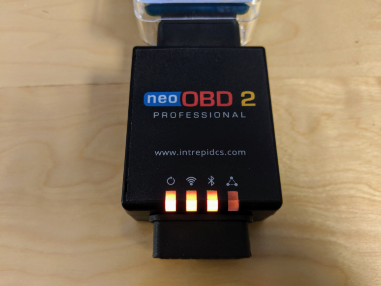
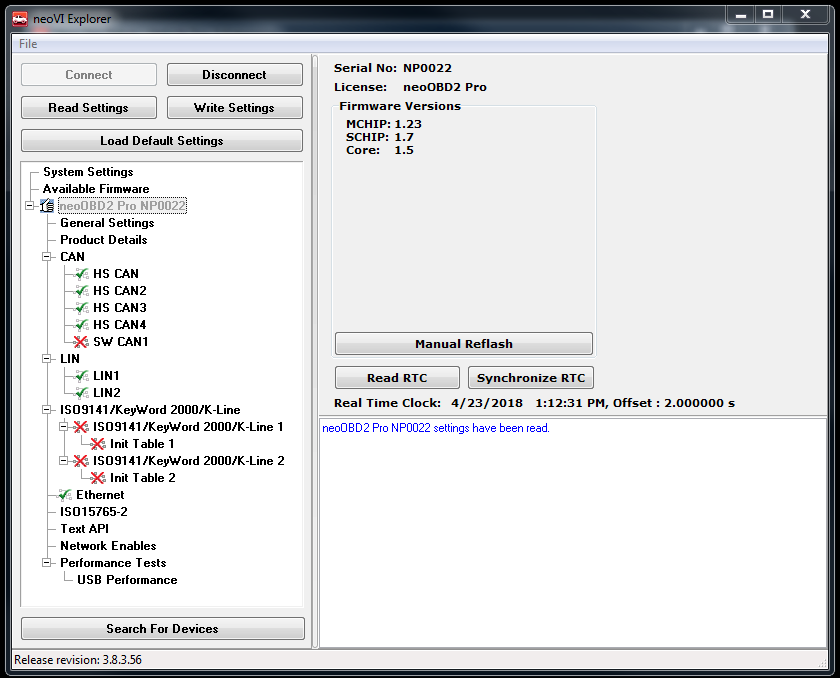
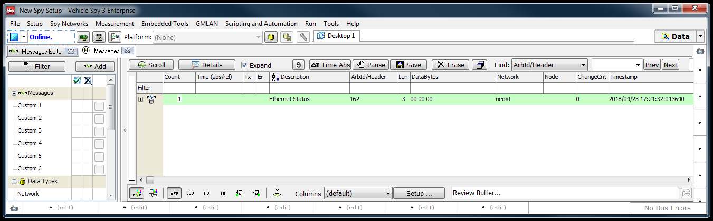
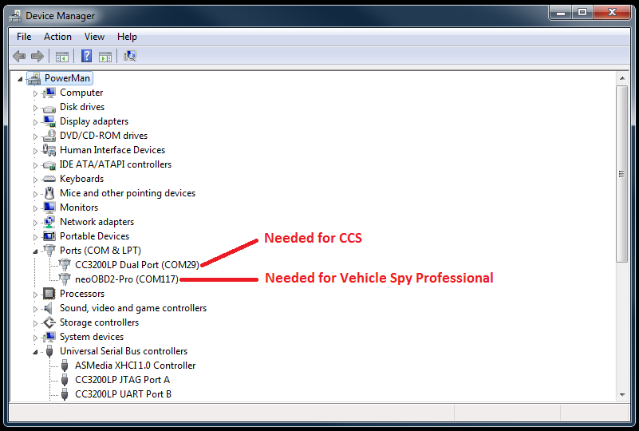

# Getting Started with neoOBD2 PRO Hardware

This guide provides the minimum level of configurations needed to setup your neoOBD2 PRO hardware for development using TI Code Composer Studio IDE and Vehicle Spy Enterprise software. 

## Prerequisites

Required Hardware:

1. [neoOBD2 PRO](https://store.intrepidcs.com/neoOBD-2-Pro-p/neoobd2-pro.htm)
2. [neoOBD2 SIM](https://store.intrepidcs.com/neoECU-CHIP-Simulator-p/neoobd2-sim.htm) (Optional)
3. [Dual USB A & USB C Cable](https://store.intrepidcs.com/productdetails_popup.asp?productcode=NEOOBD2-PRO-PROG-CABLE)
4. [12V DC Power Supply with Barrel Jack Connector](https://store.intrepidcs.com/productdetails_popup.asp?productcode=NEOVI-PS)

Required Software:

1. Vehicle Spy Enterprise

    [Vehicle Spy Enterprise](https://store.intrepidcs.com/Vehicle-Spy-p/vspy-3-ent.htm) is a single tool for diagnostics, node/ECU simulation, data acquisition, automated testing, and in-vehicle communication networks bus monitoring.
    
    For introduction, tutorials, and documentations on Vehicle Spy Enterprise, please [click here](https://cdn.intrepidcs.net/support/VehicleSpy/vehiclespyhelpdoc.html).

2. Texas Instruments Code Composer Studio IDE
	
## Install Vehicle Spy Enterprise and Configure Basic Hardware Settings

1. Run the offline installer provided with your purchase of **Vehicle Spy Enterprise**. Please [contact Intrepid Control Systems](https://www.intrepidcs.com/support/contact-support/) for a version of installer that is compatible with your neoOBD2 PRO.

2. Let's power up the neoOBD2 PRO. If you have a neoOBD2 SIM connect the **12V DC Power Supply** to neoOBD2 SIM via its barrel jack connector. Then, connect the neoOBD2 SIM to power the neoOBD2 PRO via the 16 pin male OBDII connector. If you do not have a neoOBD2 SIM, you can create a custom cable with a female OBDII connector with GND on pin 4 and VBATT on pin 16. Then, supply 12V ~ 24V through the cable. This will provide power to the neoOBD2 PRO. If you are not able to create a custom cable, you will also be able to power the neoOBD2 PRO via USB by using the provided **Dual USB A & USB C cable**. BUt it is recommended that you power the neoOBD2 PRO via its male OBDII connector using a DC power supply. Verify that the first three status LEDs from the left to right on your neoOBD2 PRO are all blinking in orange as shown below. The orange color indicates that the neoOBD2 PRO is not connected to Vehicle Spy and both the WiFi and BLE chips are running the default bootloader.

    

3. Plug in both sides of the **Dual USB A & USB C cable** to establish connection between your PC and neoOBD2 PRO. Open Vehicle Spy Enterprise. Verify Vehicle Spy Enterprise is able to detect your neoOBD2 PRO. The first LED from the left side of your neoOBD2 PRO will exhibit a blinking pattern in white color if your PC has successfully enumerated the neoOBD2 PRO.

    ")

    

4. Select **Setup** from the top menu and select **Hardware**. This will open the **neoVI Explorer**, a common hardware configuration tool for all hardware interfaces from Intrepid Control Systems. Click the **Connect** button to connect to your neoOBD2 PRO. This will read hardware settings from the connected neoOBD2 PRO. Verify the networks you wish to use are enabled. If any of the three available firmware versions need to be updated, click the **Manual Reflash** button and wait for the firmware update process to come to completion. Make sure to click the **Write Settings** button to commit any changes before closing the Hardware view.

    

5. Click the **Play** button located on the top left corner of the screen. Verify Vehicle Spy Enterprise properly transitions to **Online** state. If the neoOBD2 PRO is connected to a live CAN bus, you will be able to view all CAN message traffic from the **Messages** view. While in online state, the status LED will exhibit a blinking pattern that transitions rapidly between green and blue.

    

## Install Texas Instruments Code Composer Studio and Configure COM Ports

1. Browse to the **[TI Code Composer Studio IDE download page](http://processors.wiki.ti.com/index.php/Download_CCS)**.

2. Download the offline installer of the latest TI Code Composer Studio (the **SDK has been tested with CCS version 7.4.0**). 

3. Unzip and run the offline installer.

4. When prompted to select **Product Familes** to install, choose **SimpleLink Wi-Fi CC32xx Wireless MCUs**.

5. Accept default settings for debugging probes, and then choose **Finish**.

6. Plug in both sides of the **Dual USB A & USB C cable** to establish connection between your PC and neoOBD2 PRO. 

7. Ensure that the neoOBD2 PRO is displayed as **CC3200LP Dual Port device** under Ports (COM & LPT) in the Windows **Device Manager**.

    

## Result

At this point, your neoOBD2 PRO device is configured for use with Vehicle Spy Enterprise software. During the development process, Vehicle Spy Enterprise will be **required to program the application binary into the CC3220SF Wi-Fi module**. Vehicle Spy Enterprise is also **required to configure callbacks for receive messages you want to capture from your application.**

Your neoOBD2 PRO is also ready for TI CCS, which provides a powerful integrated development environment for your projects and supports real time USB debugging via the built-in FTDI USB emulation in neoOBD2 PRO.

## What's Next?

Start developing Wi-Fi applications by following the step-by-step guide for **[Getting Started with Wi-Fi Development on neoOBD2 PRO](OBD2PRO_WIFI_GETTING_STARTED.md).**

Start developing BLE applications by following the step-by-step guide for **[Getting Started with BLE Development on neoOBD2 PRO](OBD2PRO_BLE_GETTING_STARTED.md).**
