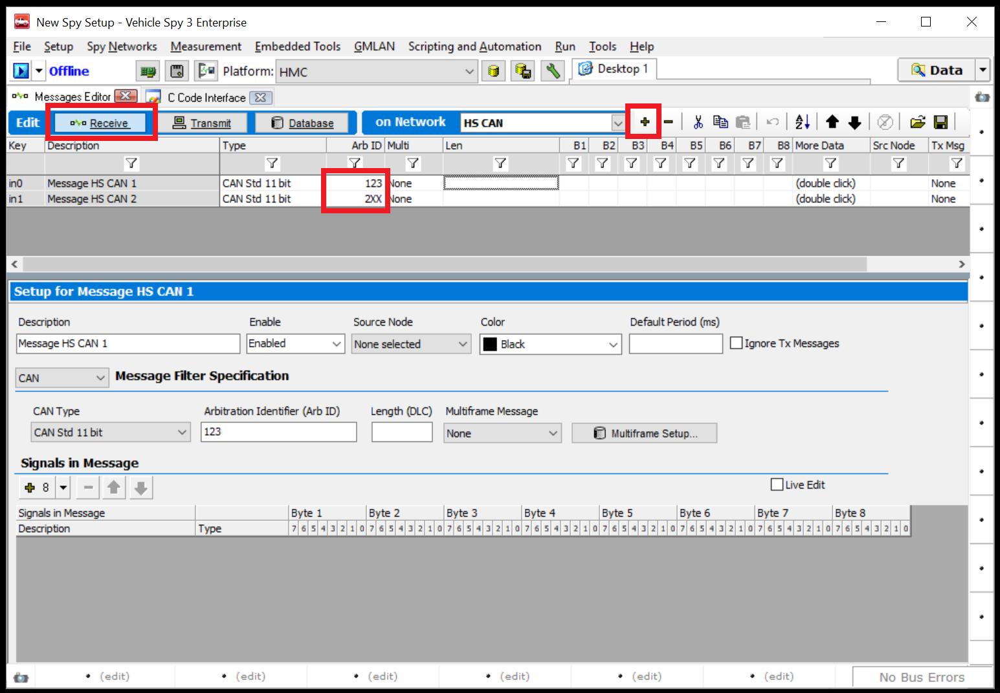
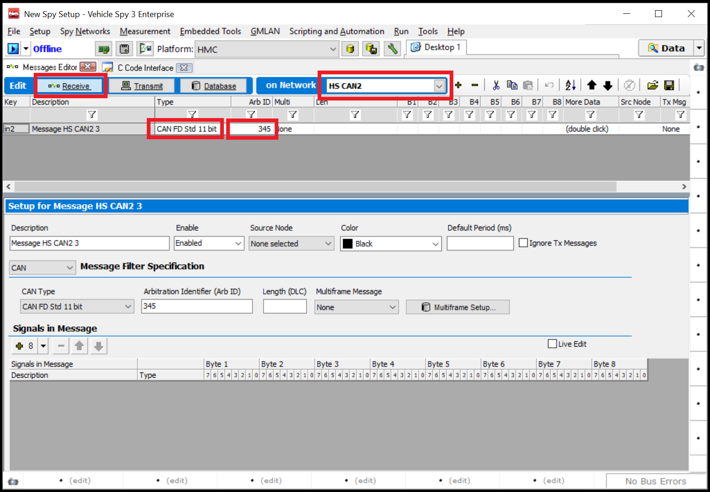
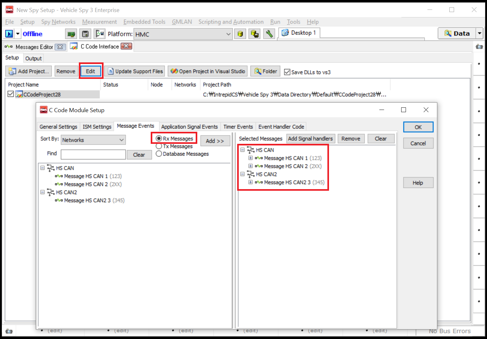
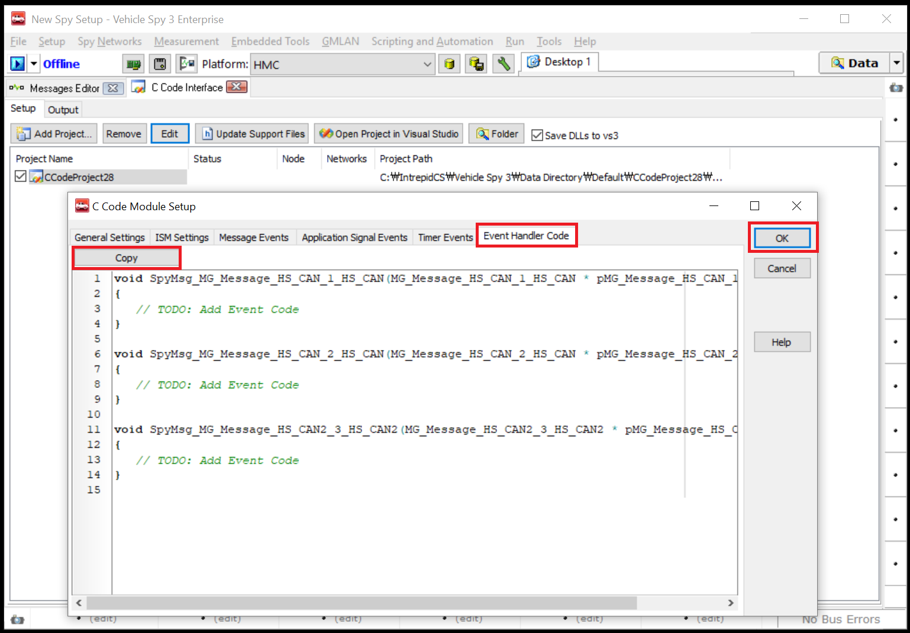
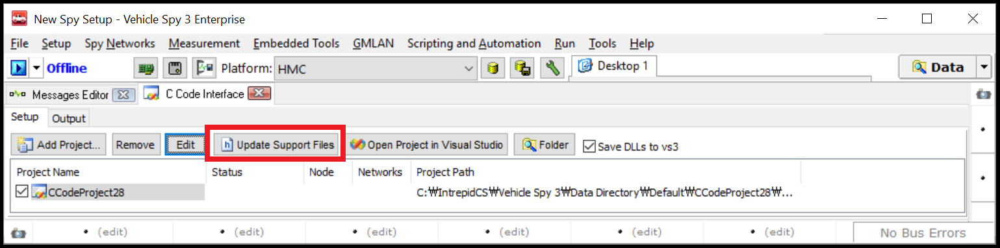
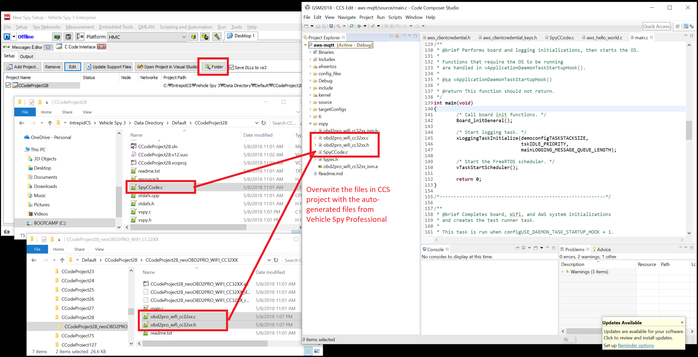
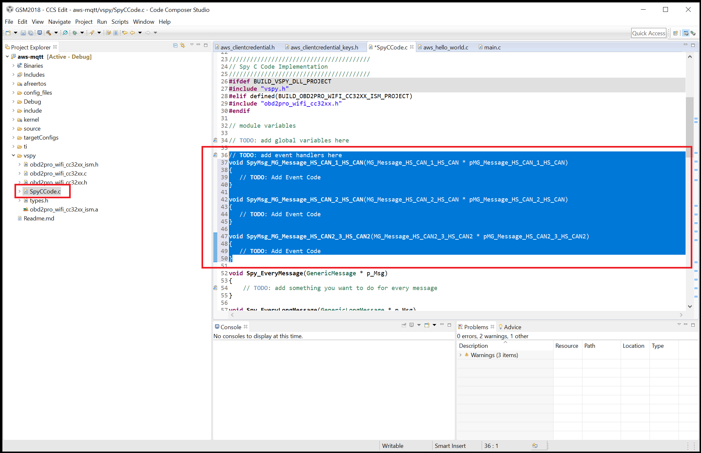
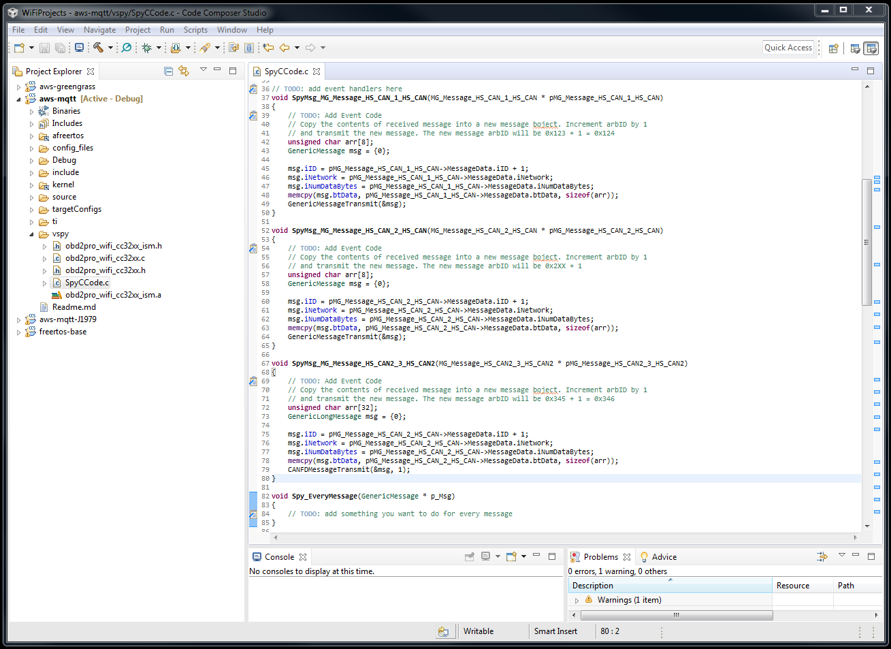

# How to Capture Vehicle Network Receive Messages from your ISM Program

Setting up your program to capture receive messages from code requires you to configure Vehicle Spy Professional accordingly. Follow the steps in this guide to capture vehicle network messages in your program.

Follow below steps to enable the ability to capture message data from your program. As an example, we will walk through the process of setting up your program to capture the following three different types of messages:

* A classical CAN message with ArbID 0x123 and 8 bytes of data on HSCAN1 network.
* Any classical CAN messages with ArbID ranging from 0x200 - 0x2FF each with 8 bytes of data on HSCAN1 network.
* A CAN-FD message with ArbID 0x345 and 32 bytes of data on HSCAN2 network.

For a complete documentations on **Vehicle Spy Enterprise**, please [click here](https://cdn.intrepidcs.net/support/VehicleSpy/vehiclespyhelpdoc.html).

1. Open Vehicle Spy Enterprise. Go to the **Scripting and Automation** menu and select **C Code Interface**. 

2. Click **Add Project...** button and select **New Project...**

3. Click the **Create embedded projects for Intrepid Security Module (ISM) devices** checkbox to inflate additional view.

	

4. Select **neoOBD2 PRO WiFi CC32XX** from the list of available ISM targets and add it to the selected ISM targets list. Click **OK** button to generate ISM source files. Note that Visual Studio will open if you have Visual Studio installed on your PC.

5. Go to the **Spy Networks** menu and select **Messages Editor**.

6. From the **on Network** dropdown menu, select **HS CAN**. Select **Receive** tab and click the **+** button to add two messages.

7. Enter **123** in the **Arb ID** field of **Message HS CAN 1** message. Enter **2XX** is the **Arb ID** field of **Message HS CAN 2** message.

	

8. From the **on Network** dropdown menu, select **HS CAN2**. Select **Receive** tab and click the **+** button to add one message.

9. Enter **345** in the **Arb ID** field of **Message HS CAN2 3** message. Change the Type of ArbID to **CAN FD Std 11 bit**.

	

10. Go back to the **C Code Interface** view. Click the **Edit** button to open the **C Code Module Setup**.

11. Go to the **Message Events** tab. Select the **Rx Messages** radio button. Double click to add all three messages into the **Selected Messages** list on the right as shown below.

	
	
12. Go to the **Event Handler Code** tab. Click the **Copy** button or perform **ctrl+c** to copy the auto-generated code stubs. The copied code will be pasted later into SpyCCode.c in your CCS project. Ensure to click **OK** button to exit out of the C Code Module Setup.

		
	
13. Click the **Update Support Files** button. This will update the three files, **SpyCCode.c, obd2pro_wifi_cc32xx.c, and obd2pro_wifi_cc32xx.h** needed for your CCS project.
	
		

14. Open **CCS** and open your project. We will use the **aws-mqtt** as an example for this guide.

15. Overwrite the **SpyCCode.c, obd2pro_wifi_cc32xx.c, and obd2pro_wifi_cc32xx.h** in your CCS project with the files automatically generated by Vehicle Spy Enterprise. The generated files are located in the C Code Interface project folder. You can easily navigate to this folder by pressing the **Folder** button from the C Code Interface view.

		
	
16. Paste the code stub copied from step 13 into **SpyCCode.c** in your CCS project.
	
		
	
17. You will notice the code stub contains three callback functions that need to be implemeted. Each callback function is associated with the three Receive Messages you have created. Whenever neoOBD2 PRO receives those messages, they will be forwarded to the associated callback function. In this guide, we will copy the messages into a different messages and transmit them, effectively gatewaying the messages.

	
	
	```c
    void SpyMsg_MG_Message_HS_CAN_1_HS_CAN(MG_Message_HS_CAN_1_HS_CAN * pMG_Message_HS_CAN_1_HS_CAN)
    {
        // TODO: Add Event Code
        // Copy the contents of received message into a new message boject. Increment arbID by 1
        // and transmit the new message. The new message arbID will be 0x123 + 1 = 0x124
        unsigned char arr[8];
        GenericMessage msg = {0};
    
        msg.iID = pMG_Message_HS_CAN_1_HS_CAN->MessageData.iID + 1;
        msg.iNetwork = pMG_Message_HS_CAN_1_HS_CAN->MessageData.iNetwork;
        msg.iNumDataBytes = pMG_Message_HS_CAN_1_HS_CAN->MessageData.iNumDataBytes;
        memcpy(msg.btData, pMG_Message_HS_CAN_1_HS_CAN->MessageData.btData, sizeof(arr));
        GenericMessageTransmit(&msg);
    }
    
    void SpyMsg_MG_Message_HS_CAN_2_HS_CAN(MG_Message_HS_CAN_2_HS_CAN * pMG_Message_HS_CAN_2_HS_CAN)
    {
        // TODO: Add Event Code
        // Copy the contents of received message into a new message boject. Increment arbID by 1
        // and transmit the new message. The new message arbID will be 0x2XX + 1
        unsigned char arr[8];
        GenericMessage msg = {0};
    
        msg.iID = pMG_Message_HS_CAN_2_HS_CAN->MessageData.iID + 1;
        msg.iNetwork = pMG_Message_HS_CAN_2_HS_CAN->MessageData.iNetwork;
        msg.iNumDataBytes = pMG_Message_HS_CAN_2_HS_CAN->MessageData.iNumDataBytes;
        memcpy(msg.btData, pMG_Message_HS_CAN_2_HS_CAN->MessageData.btData, sizeof(arr));
        GenericMessageTransmit(&msg);
    }
    
    void SpyMsg_MG_Message_HS_CAN2_3_HS_CAN2(MG_Message_HS_CAN2_3_HS_CAN2 * pMG_Message_HS_CAN2_3_HS_CAN2)
    {
        // TODO: Add Event Code
        // Copy the contents of received message into a new message boject. Increment arbID by 1
        // and transmit the new message. The new message arbID will be 0x345 + 1 = 0x346
        unsigned char arr[32];
        GenericLongMessage msg = {0};
    
        msg.iID = pMG_Message_HS_CAN_2_HS_CAN->MessageData.iID + 1;
        msg.iNetwork = pMG_Message_HS_CAN_2_HS_CAN->MessageData.iNetwork;
        msg.iNumDataBytes = pMG_Message_HS_CAN_2_HS_CAN->MessageData.iNumDataBytes;
        memcpy(msg.btData, pMG_Message_HS_CAN_2_HS_CAN->MessageData.btData, sizeof(arr));
        CANFDMessageTransmit(&msg, 1);
    }
	```

18. Follow the **Programming the Application into neoOBD2 PRO** section of the **[Getting Started with your first Wi-Fi Application for neoOBD2 PRO](OBD2PRO_WIFI_DEVELOP_FIRST_IOT_APP_GUIDE.md)** guide to program the neoOBD2 PRO with the application. 

19. Power cycle the neoOBD2 PRO and go online in Vehicle Spy Enterprise to verify the program is running as expected.

## What's Next?

Learn **[how to transmit (Tx) vehicle network messages (CAN/CANFD, LIN, Ethernet) from your program](OBD2PRO_ISM_TX_MSG_GUIDE.md)**. 
