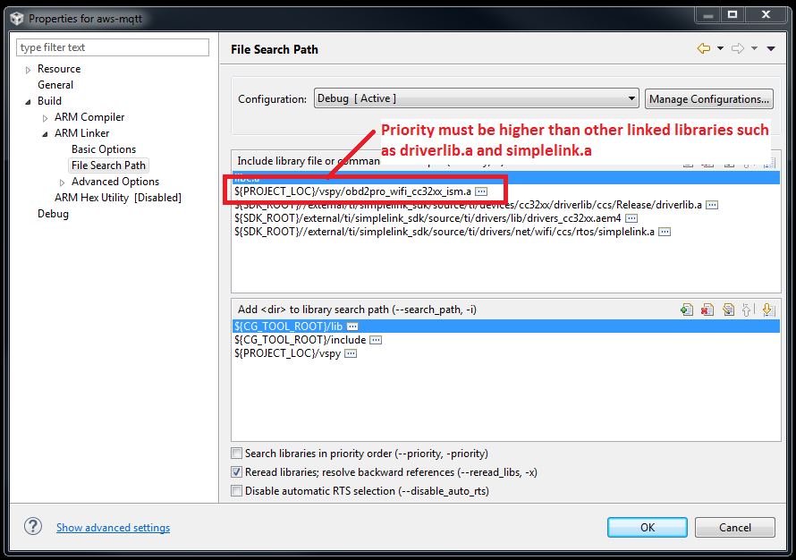

# How to Transmit Vehicle Network Messages from your ISM Program

The ISM library provides C methods that allow you to freely construct and transmit any arbitrary messages on vehicle networks supported by your neoOBD2 device. These are:

* neoOBD2 PRO: CAN/CANFD, SWCAN, LIN, and Ethernet
* neoOBD2 LC: CAN/CANFD, SWCAN, and LIN

For a complete documentations on **Vehicle Spy Enterprise**, please [click here](https://cdn.intrepidcs.net/support/VehicleSpy/vehiclespyhelpdoc.html).

<a name='prereq'></a>
## Prerequisites

Follow these steps to enable the ability to transmit messages from your program:

1. **IMPORTANT:** In order to transmit messages from your program, a **CoreMini script** must be programmed in the neoOBD2 PRO. **If transmitting CAN/LIN/Ethernet messages is the only requirement for your application** (i.e. if your program does not need to receive any messages from vehicle networks), all you need to do is to put a default CoreMini script that is available when you open up the **CoreMini Console** from Vehicle Spy Enterprise. To program a default CoreMini script to your neoOBD2 PRO, follow these steps:

	1) Open Vehicle Spy Enterprise.

	2) From top menu select **Tools**. Then, select **CoreMini Console**.

	3) From **CoreMini Console**, click the **Clear** button first to clear out any old script already running in the device.

	4) Click the **Send** button to program the new CoreMini script.

    **IMPORTANT: If your application requires you to receive messages / data from vehicle networks**, additional steps are required for setting up CoreMini accordingly. This is described in the **[How to Capture Vehicle Network Receive Messages from your ISM Program](OBD2PRO_ISM_RX_MSG_GUIDE.md)** guide.

    Note that when you program your Wi-Fi application with Vehicle Spy Enterprise as described in the **Programming the Application into neoOBD2 PRO** section of the **Getting Started with your first Wi-Fi Application for neoOBD2 PRO** guide, you are programming a CoreMini script together with the Wi-Fi application binary.

2. **IMPORTANT:** Ensure that the ISM precompiled static library **obd2pro_wifi_cc32xx_ism.a** is linked to your project. Do this in CCS by going to the **File Search Path** under **ARM Linker** section in project properties. The correct version of the library file can be located in <*SDK_PATH*>/library/ism_lib/wifi-ism_lib/CCS. **IMPORTANT:** It is critical that **the order in which the ISM library is linked to the project is higher than other libraries such as driverlib.a and simplelink.a.**

	

3. **Non-OS Environment**

	1) As part of your initialization process, insert the following code to initialize the ISM library. This must be added before you start calling the icsISM_Main method in the program's main while(1) loop. Make sure you have included the **'obd2pro_wifi_cc32xx_ism.h'** and **'obd2pro_wifi_cc32xx.h'** headers.

	```c
	icsISM_PreInit();

    RegisterInitFunc(CM_ExtensionInit);
    RegisterMsProcessFunc(Spy_EveryLoop);
    RegisterBeforeStartedFunc(Spy_BeforeStarted);
    RegisterStartedFunc(Spy_Started);
    RegisterMainFunc(Spy_Main);
    RegisterErrorFrameFunc(Spy_ErrorFrame);
    RegisterErrorStateFunc(Spy_ErrorState);
    RegisterEveryMessageFunc(CM_EveryMessage);

    icsISM_Init();
	```

	2) Below is a full sample implementation of a non-OS main. Use the code below as a reference.

	```c

	// stdlib includes
    #include <stdint.h>
    #include <stddef.h>

    #include <NoRTOS.h>

    #include "Board.h"

    // ISM Lib includes
    #include "obd2pro_wifi_cc32xx_ism.h"
    #include "obd2pro_wifi_cc32xx.h"

    extern void Spy_EveryLoop(unsigned int);
    extern void Spy_BeforeStarted(void);
    extern void Spy_Started(void);
    extern void Spy_Main(void);
    extern void Spy_ErrorFrame(int, int, int, int);
    extern void Spy_ErrorState(int, int, int, int);

    void *mainThread(void* arg0)
    {
        icsISM_PreInit();

        RegisterInitFunc(CM_ExtensionInit);
        RegisterMsProcessFunc(Spy_EveryLoop);
        RegisterBeforeStartedFunc(Spy_BeforeStarted);
        RegisterStartedFunc(Spy_Started);
        RegisterMainFunc(Spy_Main);
        RegisterErrorFrameFunc(Spy_ErrorFrame);
        RegisterErrorStateFunc(Spy_ErrorState);
        RegisterEveryMessageFunc(CM_EveryMessage);

        icsISM_Init();

        while (1)
        {
            icsISM_Main();
        }

        return 0; 
    }

    int main(void)
    {
        /* Call driver init functions */
        Board_initGeneral();

        /* Start NoRTOS */
        NoRTOS_start();

        /* Call mainThread function */
        mainThread(NULL);

        while (1);
    }

	```

2. **Amazon FreeRTOS Environment**

    1) The process is very similar to that of the non-OS environment. The key point is that **you have to ensure the full ISM initialization process is executed before you start any tasks, including the task where you will need to call icsISM_Main method in a while(1) loop that never terminates**. You would normally want to execute the full initialization process in the startup hook that runs when configUSE_DAEMON_TASK_STARTUP_HOOK = 1. Below is a reference code from main.c of the **aws-mqtt sample project** included with the SDK. Also, make sure you have included the **'obd2pro_wifi_cc32xx_ism.h'** and **'obd2pro_wifi_cc32xx.h'** headers.

	```c
	void vApplicationDaemonTaskStartupHook(void);

	extern void Spy_EveryLoop(unsigned int);
	extern void Spy_BeforeStarted(void);
	extern void Spy_Started(void);
	extern void Spy_Main(void);
	extern void Spy_ErrorFrame(int, int, int, int);
	extern void Spy_ErrorState(int, int, int, int);

	/**
	 * @brief This function initializes the ISM.
	 *
	 * Must be called before calling icsISM_Main().
	 *
	 * @sa ismInit()
	 *
	 * @return void
	 */
	void ismInit()

	{
			icsISM_PreInit();

			RegisterInitFunc(CM_ExtensionInit);
			RegisterMsProcessFunc(Spy_EveryLoop);
			RegisterBeforeStartedFunc(Spy_BeforeStarted);
			RegisterStartedFunc(Spy_Started);
			RegisterMainFunc(Spy_Main);
			RegisterErrorFrameFunc(Spy_ErrorFrame);
			RegisterErrorStateFunc(Spy_ErrorState);
			RegisterEveryMessageFunc(CM_EveryMessage);

			icsISM_Init();
	}

	/**
	 * @brief Completes board, Wifi, and AWS system initializations
	 * and creates the test runner task.
	 *
	 * This task is run when configUSE_DAEMON_TASK_STARTUP_HOOK = 1.
	 */
	void vApplicationDaemonTaskStartupHook(void)
	{
			UART_Handle xtUartHndl;
			WIFINetworkParams_t xNetworkParams;

			Board_initGPIO();
			Board_initSPI();

			/* Configure the UART. */
			xtUartHndl = InitTerm();
			UART_control(xtUartHndl, UART_CMD_RXDISABLE, NULL);

			WIFI_On();

			vDevModeKeyProvisioning();

			/* Initialize the AWS library system. */
			BaseType_t xResult = SYSTEM_Init();
			configASSERT(xResult == pdPASS);

			/* Initialize Network params. */
			xNetworkParams.pcSSID = clientcredentialWIFI_SSID;
			xNetworkParams.ucSSIDLength = sizeof(clientcredentialWIFI_SSID);
			xNetworkParams.pcPassword = clientcredentialWIFI_PASSWORD;
			xNetworkParams.ucPasswordLength = sizeof(clientcredentialWIFI_PASSWORD);
			xNetworkParams.xSecurity = clientcredentialWIFI_SECURITY;

			WIFI_ConnectAP(&xNetworkParams);

			/* Initialize the Intrepid ISM Library before starting app tasks */
			ismInit();

			DEMO_RUNNER_RunDemos();
	}
	```

## Transmitting Classical CAN Messages

First, **[ensure you have completed the prerequisite section of this guide](#prereq)** bofore proceeding.

A Classical CAN message with an 8-byte payload can be transmitted by using the **GenericMessageTransmit()** method.

```c
GenericMessage msg = {0};

msg.iID = 0x111;        // Assign arbitration ID (0 ~ 7FF)
msg.iNetwork = 1;       // Assign CAN network to use on neoOBD2 PRO
                        // HSCAN1 = 1, HSCAN2 = 42, HSCAN3 = 44, HSCAN4 = 61
msg.iNumDataBytes = 8;  // Specify the payload length
msg.btData[0] = 0x11;   // Fill the 8 byte payload
msg.btData[1] = 0x22;
msg.btData[2] = 0x33;
msg.btData[3] = 0x44;
msg.btData[4] = 0x55;
msg.btData[5] = 0x66;
msg.btData[6] = 0x77;
msg.btData[7] = 0x88;

GenericMessageTransmit(&msg); // Transmit the constructed message!
```

## Transmitting CAN-FD Messages

First, **[ensure you have completed the prerequisite section of this guide](#prereq)** bofore proceeding.

A CAN-FD message with up to 64-byte payload can be transmitted by using the **CANFDMessageTransmit()** method.

```c
uint8_t brsEnable = 1;
GenericLongMessage msg = {0};

msg.iID = 0x111;            // Assign arbitration ID (0 ~ 7FF)
msg.iNetwork = 1;           // Assign CAN network to use on neoOBD2 PRO
                            // HSCAN1 = 1, HSCAN2 = 42, HSCAN3 = 44, HSCAN4 = 61
msg.iNumDataBytes = 64;     // Specify the payload length
for (i = 0; i < msg.iNumDataBytes; i++) // Fill-in 64 byte payload with some data
    msg.btData[i] = i;

CANFDMessageTransmit(&msg, brsEnable);  // Transmit the constructed CAN-FD message with BRS enabled
```

## Transmitting LIN Messages

First, **[ensure you have completed the prerequisite section of this guide](#prereq)** bofore proceeding.

A LIN message with up to 8-byte payload can be transmitted by using the **GenericMessageTransmit()** method.

```c
GenericMessage msg = {0};

msg.iID = 0x3C;        	// Assign LIN ID
msg.iNetwork = 16;      // Assign CAN network to use on neoOBD2 PRO
                        // LIN1 = 16, LIN2 = 48
msg.iNumDataBytes = 8;  // Specify the payload length
msg.btData[0] = 0x11;   // Fill the 8 byte payload
msg.btData[1] = 0x22;
msg.btData[2] = 0x33;
msg.btData[3] = 0x44;
msg.btData[4] = 0x55;
msg.btData[5] = 0x66;
msg.btData[6] = 0x77;
msg.btData[7] = 0x88;

GenericMessageTransmit(&msg); // Transmit the constructed message!
```

## Transmitting Ethernet Messages

Coming soon.

## What's Next?

Learn **[how to receive (Rx) vehicle network messages (CAN/CANFD, LIN, Ethernet) from your program](OBD2PRO_ISM_RX_MSG_GUIDE.md)**.
