# Getting Started with your first Wi-Fi Application for neoOBD2 PRO

This guide provides a step-by-step guide on creating, debugging, and deploying a sample ready-to-build TI CC3220SF Wi-Fi application for neoOBD2 PRO. This sample project is included in the SDK. The application is based on Amazon FreeRTOS. It connects the CC3220SF in the neoOBD2 PRO to AWS IoT Core and exchanges MQTT messages while also transmitting classical CAN messages on HSCAN1 network of neoOBD2 PRO. When the sample application is properly configured and programmed into the CC3220SF Wi-Fi processor, the neoOBD2 PRO will perform the following:

* Initialize and enable the CC3220SF's Wi-Fi subsystem.
* Provision *certificate and private key* needed to connect to the AWS IoT Core.
* Use user-configured *Wi-Fi credentials* to connect to an Access Point.
* Connect to MQTT broker for your AWS IoT Core account.
* Publish *"Hello World"* message every five seconds to the *freertos/demos/echo* topic.
* Subscribe to the same *freertos/demos/echo* topic we are publishing to, which will cause the published *Hello World* messages to loop back to neoOBD2 PRO. 
* Transmit a classical CAN message when the *Hello World* message loops back to neoOBD2 PRO.

## Prerequisites

Required Hardware:

1. neoOBD2 PRO
2. Dual USB A & USB C Cable

Required Software:

1. neoOBD2 SDK
2. Vehicle Spy Enterprise

    [Vehicle Spy Enterprise](https://store.intrepidcs.com/Vehicle-Spy-p/vspy-3-ent.htm) is a single tool for diagnostics, node/ECU simulation, data acquisition, automated testing, and in-vehicle communication networks bus monitoring.
    
    For introduction, tutorials, and documentations on Vehicle Spy Enterprise, please [click here](https://cdn.intrepidcs.net/support/VehicleSpy/vehiclespyhelpdoc.html).

3. TI Code Composer Studio (CCS) IDE

Misc requirements:

1. AWS IoT account with access to the AWS IoT console - [create one here](https://aws.amazon.com)
	
## Importing the Sample Project and Building it in CCS

1. To get started with a project in CCS select "*SDK_PATH*/demos/intrepid/neoobd2_pro" as the Workspace in the startup dialog box, where *SDK_PATH* is the local path where you have downloaded the neoOBD2 SDK. 
	
2. Go to **File** on the top menu and select **Import...**. When prompted, select **CCS Projects**.
	
	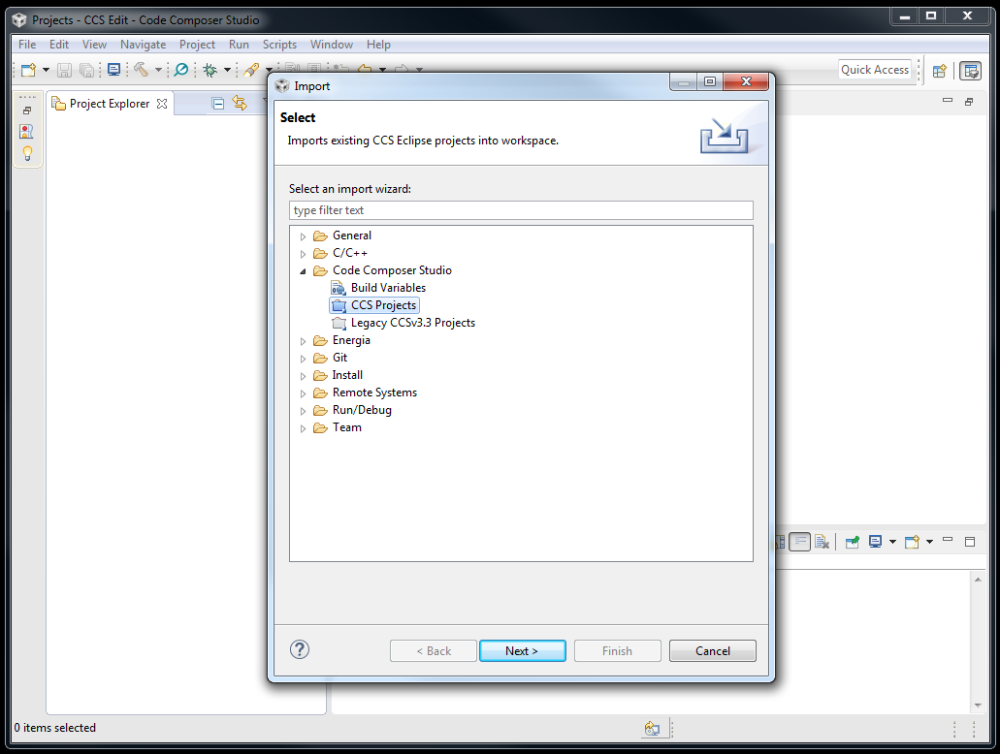
	
3. Browse to the Workspace path itself, i.e. "*SDK_PATH*/demos/intrepid/neoobd2_pro" folder. Then, a list of available samples will be populated. Select the **aws-mqtt** sample from the list. Enable the **Copy projects into workspace** checkbox and click Finish to complete the import process.

	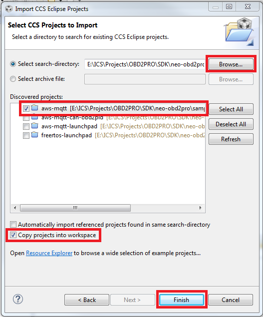
	
4. **IMPORTANT:** Before you do anything else. It is important to perform **Build Project** to see if you can successfully build the imported sample project. The imported sample project should build as is without any changes. A successful build will give you a .bin binary in the output folder (this will be Debug or Release, depending on Project properties).
	
	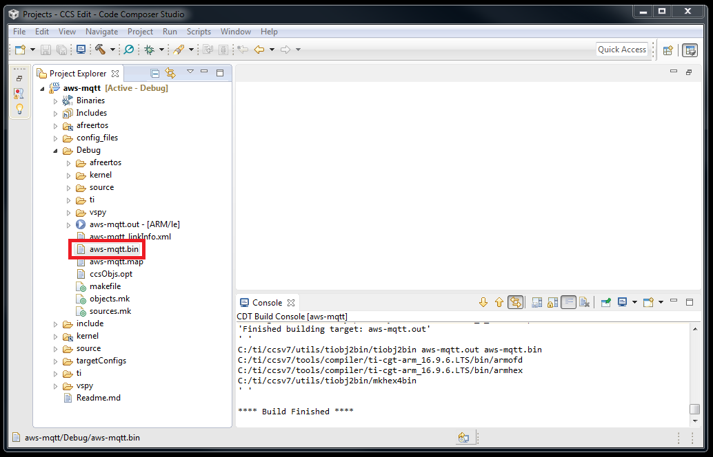
	
## Setting up your AWS IoT Environment

1. Before you begin, please see [AWS IoT Prerequisites](https://docs.aws.amazon.com/freertos/latest/userguide/freertos-prereqs.html) to setup an IoT thing, private key, certificate, and policy.

2. Create an AWS IoT account at [https://aws.amazon.com](https://aws.amazon.com).

3. Browse to the [AWS IoT console.](https://console.aws.amazon.com/iotv2/)

4. In the left navigation pane, choose **Settings**.

5. Copy your AWS IoT endpoint from the **Endpoint** text box. It should look like <*1234567890123-ats*>.iot.<*us-east-1*>.amazonaws.com.
	
6. Open *include/aws_clientcredential.h* from **CCS project explorer** and set clientcredentialMQTT_BROKER_ENDPOINT to your AWS IoT endpoint. You also need to know your Wi-FI network SSID, password, and security type, and the name of the AWS IoT thing that represents your device. Valid security types are:

	    * eWiFiSecurityOpen: Open, no security.
	    * eWiFiSecurityWEP: WEP security.
	    * eWiFiSecurityWPA: WPA security.
	    * eWiFiSecurityWPA2: WPA2 security.

    From **CCS project explorer**, open *include\aws_clientcredential.h.*

    Specify values for the following #define constants:

    	* clientcredentialMQTT_BROKER_ENDPOINT: Your AWS IoT endpoint.
	    * clientcredentialIOT_THING_NAME: The AWS IoT thing for your board.
	    * clientcredentialWIFI_SSID: The SSID for your Wi-Fi network.
	    * clientcredentialWIFI_PASSWORD: The password for your Wi-Fi network.
	    * clientcredentialWIFI_SECURITY: The security type for your Wi-Fi network.
	
7. The certificate and private key must be hard-coded into the sample code. Amazon FreeRTOS is a C language project, and the certificate and private key must be specially formatted to be added to the project. **To format your certificate and private key:**

	1. In a browser window, open <*SDK_Path*>\tools\certificate_configuration\CertificateConfigurator.html.

	2. Under **Certificate PEM file**, choose the <*ID*>-certificate.pem.crt you downloaded from the AWS IoT console.

	3. Under **Private Key PEM file**, choose the <*ID*>-private.pem.key you downloaded from the AWS IoT console.

	4. Choose **Generate and save aws_clientcredential_keys.h**, and then save the file in your CCS project directory at <*Your_CCS_Project_Path*>/include. This overwrites the stub file in the directory.

## Importing auto-generated ISM codes from Vehicle Spy Enterprise

The **ISM library (obd2pro_wifi_cc32xx_ism.a)** and a set of **auto-generated ISM source files (obd2pro_wifi_cc32xx.c, obd2pro_wifi_cc32xx.h, and SpyCCode.c) from Vehicle Spy Enterprise** are the software components that grant the code running on CC3220SF transmit and receive access to data over the vehicle networks supported by neoOBD2 PRO (CAN/CANFD, LIN, and Ethernet).

Although the **aws-mqtt** sample project comes with those files already integrated, please follow this guide to learn how to generate and import them as they are essential components of Wi-Fi application development with neoOBD2 PRO.

1. Open Vehicle Spy Enterprise. Go to the **Scripting and Automation** menu and select **C Code Interface.** 

2. Click **Add Project...** button and select **New Project...**

3. Click the **Create embedded projects for Intrepid Security Module (ISM) devices** checkbox to inflate additional view.

	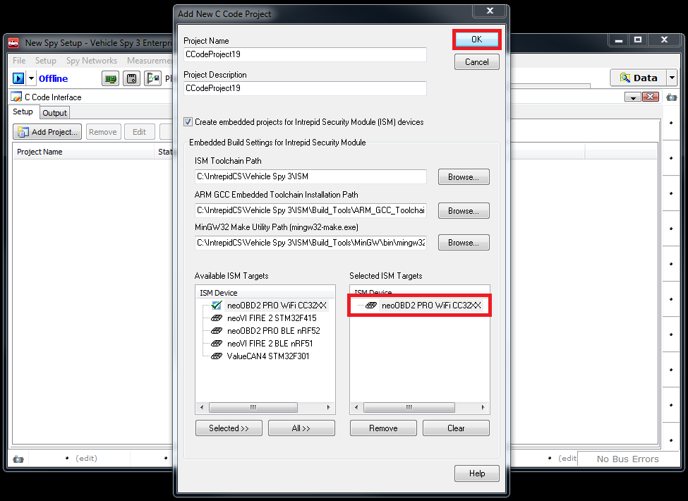

4. Select **neoOBD2 PRO WiFi CC32XX** from the list of available ISM targets and add it to the selected ISM targets list. Click **OK** button to generate ISM source files. Note that Visual Studio will open if you have Visual Studio installed on your PC.

5. Go back to the **C Code Interface view**. Click the **Folder** button which will open up a file explorer in the root directory of the generated C Code Project. 

	

6. **IMPORTANT:** Before proceeding further, save the Vehicle Spy Enterprise project (.vs3) by going to **File** on top menu and selecting **Save**. The saved .vs3 project will be used later to program the completed application into the CC3220SF in neoOBD2 PRO.

	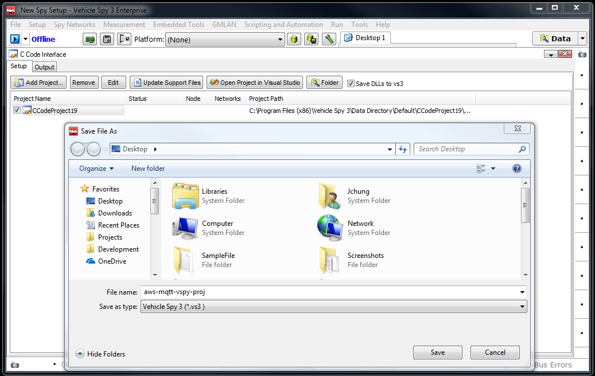

7. Copy the **SpyCCode.c** file and overwrite the one located inside the **vspy** folder of the aws-mqtt sample project in CCS.

	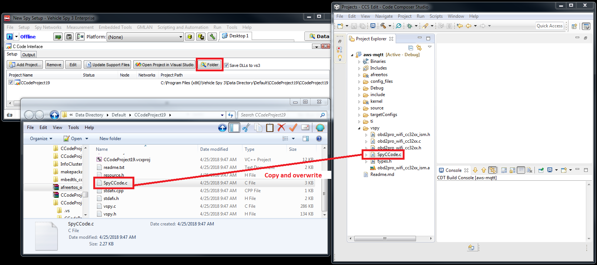
	
    **You may need to fix up SpyCCode.c** so that **obd2pro_wifi_cc32xx.h** is included properly.
	
	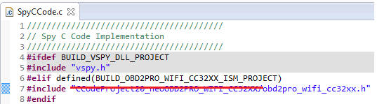
	
8. Go back to the file explorer. Open the **ProjectName_neoOBD2PRO_WIFI_CC32XX** folder. Copy **obd2pro_wifi_cc32xx.c** and **obd2pro_wifi_cc32xx.h** files and overwrite the one located inside the **vspy** folder of the aws-mqtt sample project in CCS.

	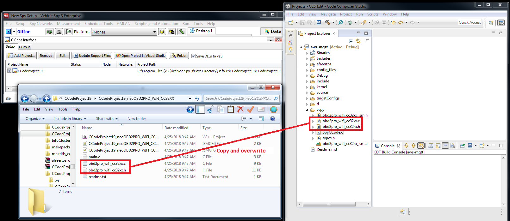

9. Open project properties in CCS and verify the **BUILD_OBD2PRO_WIFI_CC32XX_ISM_PROJECT** is defined in **Predefined Symobls** list.

	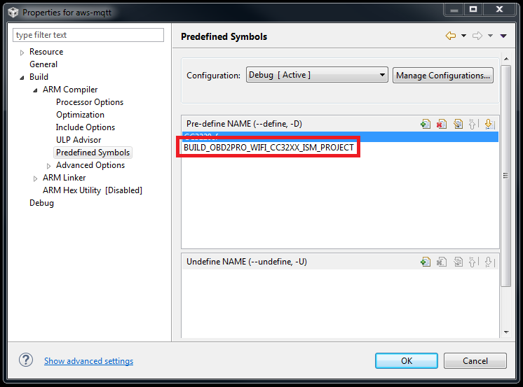

10. Build the aws-mqtt project and verify the project builds successfully.
	
	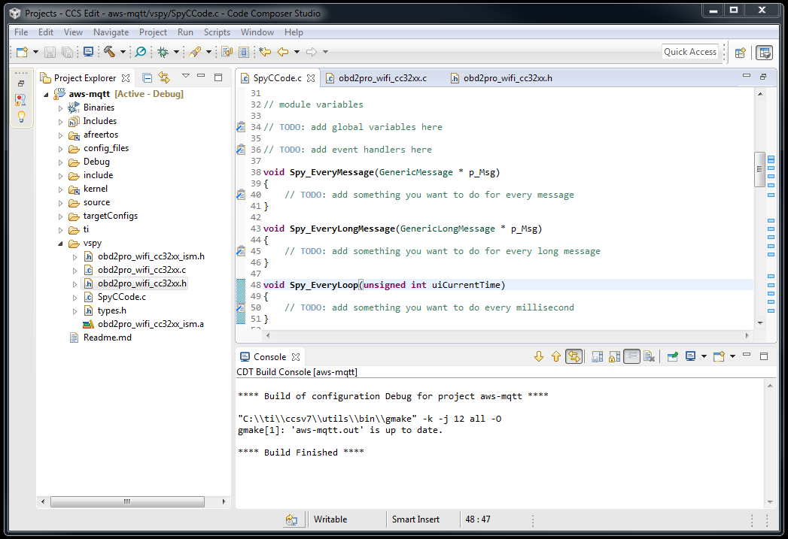
	
## Running and Debugging the Application
	
Now that you have successfully imported and built your first sample Wi-Fi project, you can run the application in debug mode via the on-board CC3220SF USB debugger. You can sign in to your AWS IoT cosole to verify that the neoOBD2 PRO is talking to AWS IoT core.

1. Use the Dual USB A & USB C Cable to connect your neoOBD2 PRO to your PC. Verify you have connection by opening Windows Device Manager. **CC3200LP Dual Port** should be preesent under Ports (COM & LPT).

	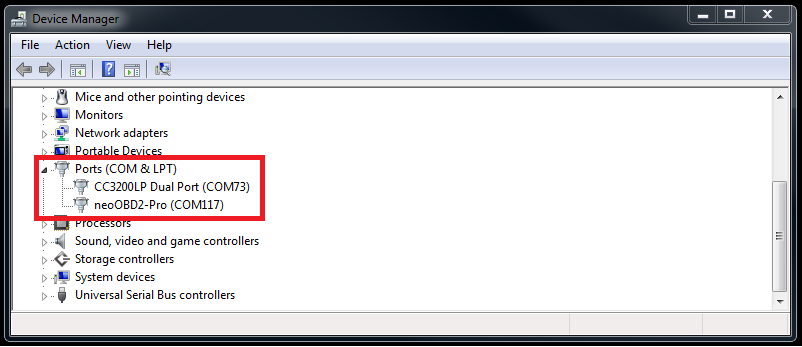

2. Go to Project Properties in CCS. Ensure the Connection is set to **Stellaris In-Circuit Debug Interface.** Set the Variant to **CC3220SF** from the drop-down. 

	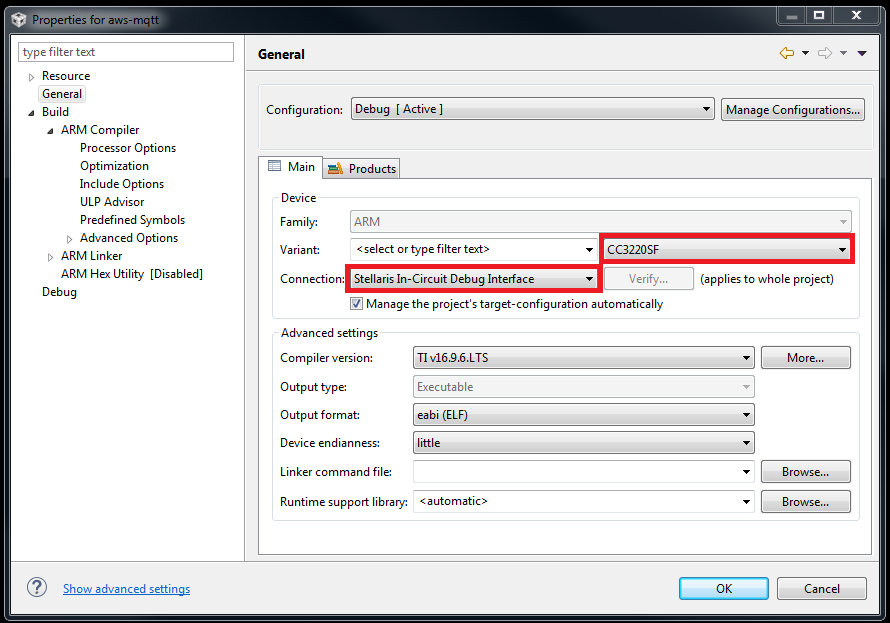

3. Under **targetConfigs**, find and open the Target Configuration file **CC3220SF.ccxml.** Make sure the Connection is set to **Stellaris In-Circuit Debug Interface**. Also set the Board or Device option to **CC3220SF**. 

	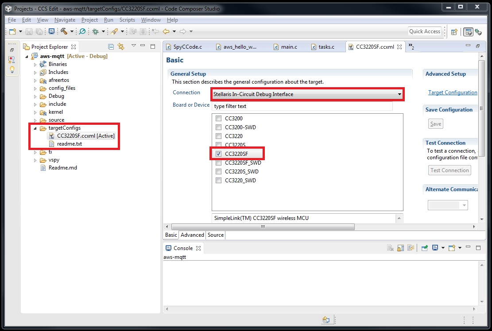
	
4. Rebuild your project.

5. Sign in to the AWS IoT console.

6. In the left navigation pane, choose **Test** to open the MQTT client.

7. In the **Subscription topic** text box, type **freertos/demos/echo**, and then choose **Subscribe to topic.**
	
8. In CCS, run the project in debug by going to the **Run** menu and selecting **Debug**. You should see the CCS IDE writing the application into the internal FLASH of CC3220SF directly. Then, the program will breakpoint in main() prompting you to continue execution. Go to the **Run** menu, and then choose **Resume.**

	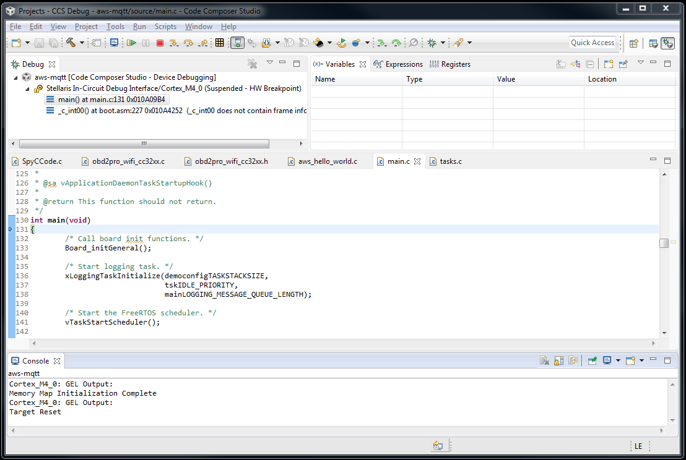

9. In the MQTT client in the AWS IoT console, you should see the MQTT messages sent by neoOBD2 PRO.

	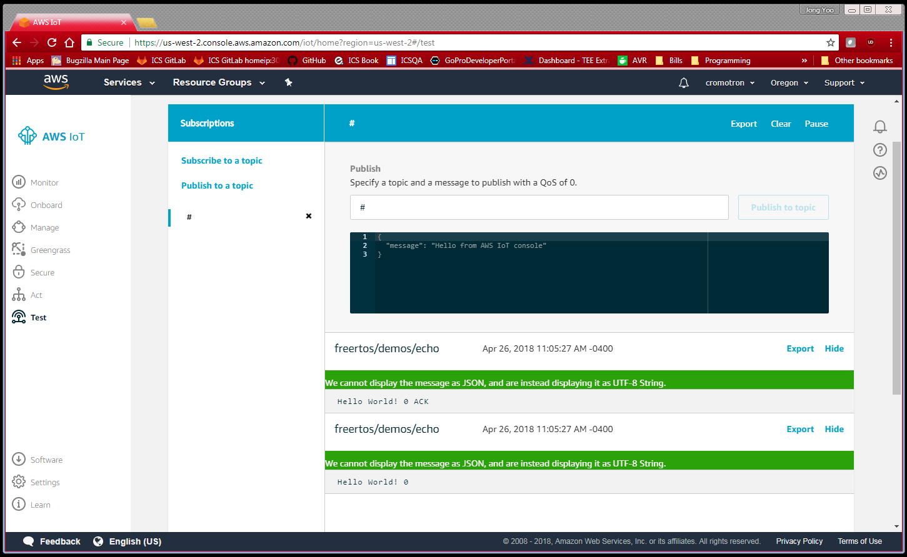

10. In Vehicle Spy Enterprise, you should see neoOBD2 PRO transmitting a classical CAN message with Arbitration ID 0x01 on HSCAN1 network.

	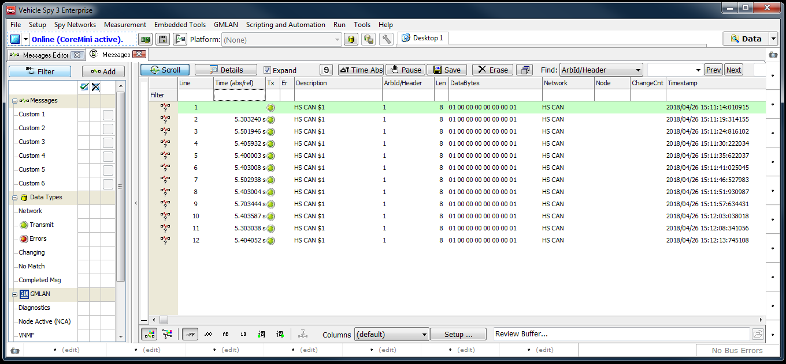
	
## Programming the Application into neoOBD2 PRO

Once your Wi-Fi program is ready to be deployed in neoOBD2 PRO, you can use Vehicle Spy to do so.

The CC3220SF Wi-Fi module in neoOBD2 PRO is programmed with an application bootloader at production, which allows Vehicle Spy to program application binary. The application bootloader is always executed first from external secure FLASH. If the application bootloader detects a valid application in the external FLASH, it will load it into its internal FLASH and begin execution. Otherwise, the application bootloader will wait indefinitely for Vehicle Spy to send a valid application. 

1. Open the **.vs3 project saved from step 6 of Importing auto-generated ISM codes from Vehicle Spy Enterprise** section. 

2. Go to **Scripting and Automation** from the top menu and select **C Code Interface**. Click the **Folder** button which will open up a file explorer in the root directory of the generated C Code Project. 

	

3. Navigate inside the **ProjectName_neoOBD2PRO_WIFI_CC32XX** folder. Create a new folder and name it **Release**. Now drag and rop the application binary file **aws-mqtt.bin** from CCS into the created Release folder.

	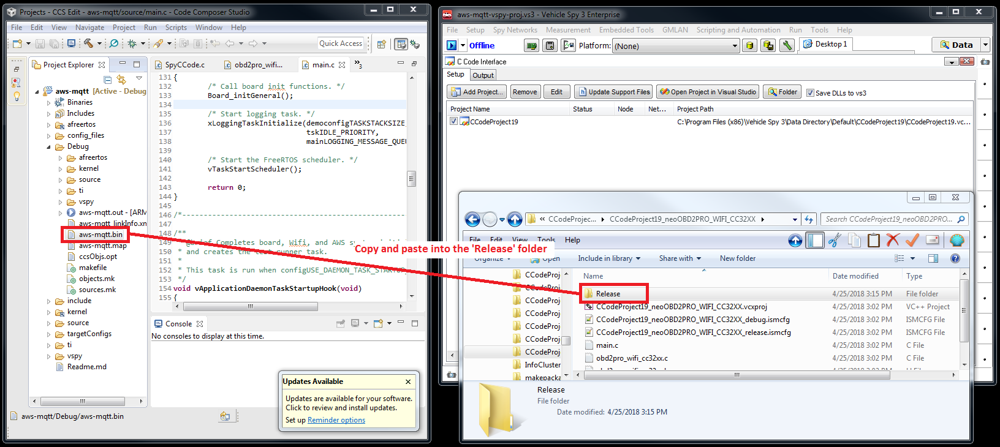

4. Go to **Tools** from the top menu and select **CoreMini Console**. This will open a utility you can use to program the neoOBD2 PRO. Press the **Clear** button to clean the neoOBD2 PRO first.

	

5. Next, press the **Send** button to program the application into neoOBD2 PRO. Make sure the status message **Sending CCIF Binary Data** appears followed by a Success message. If **Sending CCIF Binary Data** message does not appear during the programming process, go back to step 3 and **make sure the aws-mqtt.bin is correctly placed inside the 'Release' folder**. The folder must be named **'Release'**.

	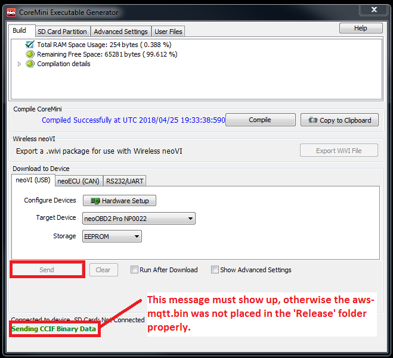

6. Unplug the Dual USB A & USB C cable to power off the neoOBD2 PRO.

7. Plug in the Dual USB A & USB C cable again to power the neoOBD2 PRO back on. At this point the status LED on neoOBD2 PRO should be blinking in magenta (purple), indicating that the program is running. Whenever a new application is programmed, it takes roughly 20 ~ 30 seconds for the program to execute. An existing application typically takes less than 5 seconds to start executing.

## What's Next?

Now that you are able to import, debug, and program a sample project: 

* Learn **[how to transmit (Tx) vehicle network messages (CAN/CANFD, LIN, Ethernet) from your program](OBD2PRO_ISM_TX_MSG_GUIDE.md)**. 

* Learn **[how to receive (Rx) vehicle network messages (CAN/CANFD, LIN, Ethernet) from your program](OBD2PRO_ISM_RX_MSG_GUIDE.md)**.
