# J1979 Mode 01 PID Reader Sample Project Guide

This sample application is based on the default 'aws_demos' sample application provided with the Amazon FreeRTOS distribution for CC3220SF-Launchxl.

First, the application uses Simplelink FileSystem API to read credentials such as AWS IoT endpoint address, certificate, private key, and Wi-Fi credentials from a file called **aws_iot_config** stored in the CC3220SF file system.

After using the credentials to establish connection to the AWS IoT broker, the application creates the following three tasks:

1. CAN TX Task: Per every loop, this tasks constructs a CAN2.0 message that is transmitted to the Vehicle CAN bus via the OBDII diagnostics port the neoOBD2 PRO is connected to. The PIDs requested originate from the list of PIDs configured by the user in the 'aws_iot_config' file.
2. ISM Task: This task calls the Intrepid Security Module every loop, which allows exchange of vehicle network data and other processor to processor commands between the main data acquisition processor and the CC320SF application processor. It is critical for this task to be free from any delay (i.e: no vTaskDelay allowed in the while(1) loop).
3. MQTT Publish Task: This task publishes the array of 132bytes of data containing all 32 OBDII PID values to the connected AWS IoT broker. The topic to which the data is published to is 'obd2pro/pids'

## Prerequisites

Required Hardware:

1. neoOBD2
2. Dual USB A & USB C Cable

Required Software

1. Vehicle Spy Professional
2. Texas Instruemnts Code Composer Studio (CCS) IDE
3. Texas Instruments Uniflash Tool
4. neoOBD2 SDK

## Configuration File

The **aws_iot_config** file is a text file that contains credentials and settings for the application to i) connect to the WiFi access point you wish to use, ii) connect to the AWS IoT MQTT broker endpoint of your choice and iii) the list of OBDII PIDs you wish to collect and publish to the said AWS IoT MQTT broker endpoint.

### Updating the Config File

1. Open the provided **aws_iot_config** file from the <*PROJECT_PATH*>/setup_files directory.

2. Locate the first configurable field in the file, which shall be **static const unsigned char pidNumberLookup[32]**.

	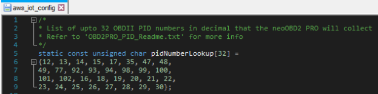

3. In decimal value, enter the OBDII PID number you wish to collect & publish to AWS IoT. The list of available OBDII PID numbers can be found [**here**](https://en.wikipedia.org/wiki/OBD-II_PIDs) under the section **Mode 01**.

4. For example, if you would like to collect & publish the Engine RPM (PID 12) and Vehicle Speed (PID 13). The pidNumberLookup should be configured as follows:

	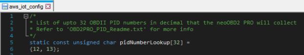

5. Download your certificate and private key from the AWS IoT console. Use the **CertificateConfigurator.html** tool to convert the certificate and private key into a char array format compatible for C language. Copy and paste the certificate and private key into the aws_iot_config file under matching fields at **clientcredentialCLIENT_CERTIFICATE_PEM** and **clientcredentialCLIENT_PRIVATE_KEY_PEM**.

6. Locate the field **clientcredentialMQTT_BROKER_ENDPOINT**. Copy and paste your AWS IoT endpoint here. It should look like <*1234567890123*>.iot.<*us-east-1*>.amazonaws.com

	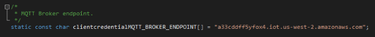

7. Locate the field **clientcredentialMQTT_BROKER_PORT**. Set this to 8883.

	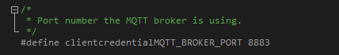

8. Locate the field **clientcredentialGREENGRASS_DISCOVERY_PORT**. Set this to 8443. This is just a dummy entry for this specific application; the application is programmed to connect to AWS IoT and not Greengrass.

	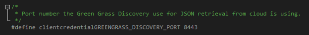

9. Locate the field **clientcredentialWIFI_SSID**. Set it to the SSID for your WiFi network.

	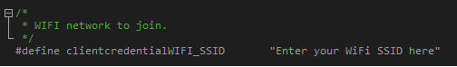

10. Locate the field **clientcredentialWIFI_PASSWORD**. Set it to the password for your WiFi network.

	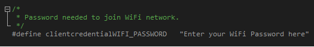

11. Locate the field **clientcredentialWIFI_SECURITY**. Set it to the security type for your WiFi network.

	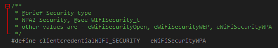

### Programming the Config File

1. Plug-in the neoOBD2 PRO to your laptop via USB Type-A to Type-C cable.

2. Open the Uniflash software. Verify the connection is **Stellaris in-Circuit Debug Interface**. Then, search and choose the **CC3220SF-LAUNCHXL**. Verify the Selected Connection is set to **Serial(UART) Interface** and click the **Start Image Creator** button.

	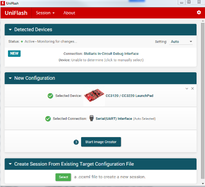

3. Create a **New Project**. Select **Device Type to CC3220SF** and **Device Mode to Develop**.

	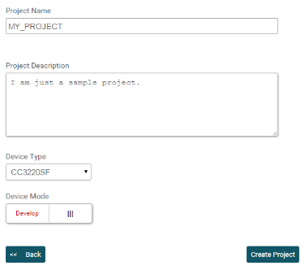

4. Click the Connect button.

5. Click the User File Browser button.

	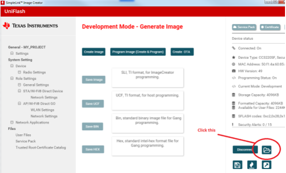

6. If there is already an aws_iot_config file in the filesystem, delete it.

7. Add your aws_iot_config file by pressing the Add File button. In the pop-up window, click Write button with default settings.

	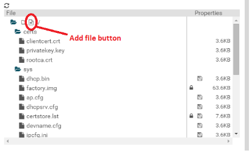
	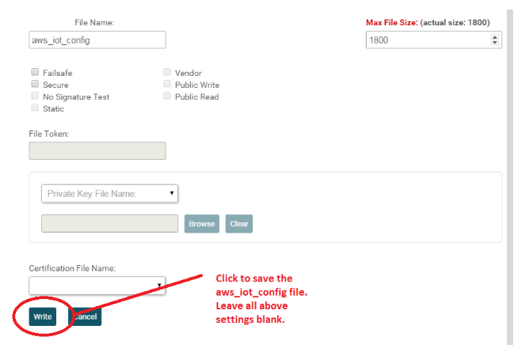

8. Close the Uniflash application. Disconnect your neoOBD2 PRO from PC by removing the USB cable.

## Programming the Application

### Build the Application

1. Open CCS and import the Greengrass sample project from <*SDK_PATH*>/samples/aws-greengrass. Build the project.

	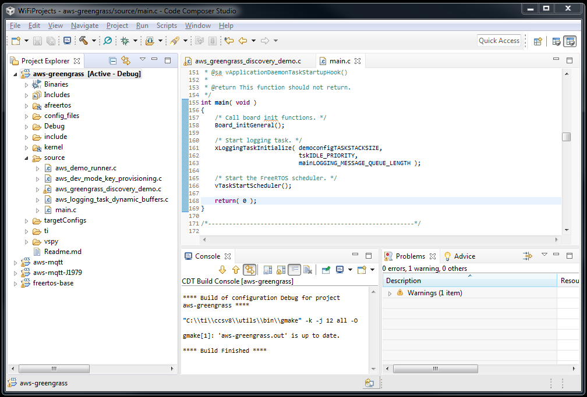

2. Locate the output binary file from **Debug** directory.

	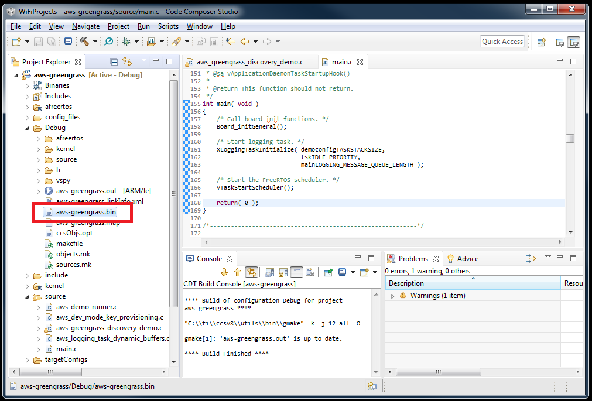

### Use Vehicle Spy Professional to Program the Application

1. Connect your neoOBD2 PRO to the PC using the dual USB A & USB C cable.

2. Open Vehicle Spy Professional.

3. Go to **File** and select **Open...**. Select the VS3 file **aws-mqtt-JJ1979-setup.vs3** located in <*PROJECT_PATH*>/setup_files.

4. Go to **Scripting and Automation** and select **C Code Interface**.

5. Click the **Add Project...** button and select **New Project**.

6. Click the **Create embedded projects for Intrepid Security Module (ISM) devices** checkbox to inflate additional view. Select **neoOBD2 PRO WiFi CC32XX** and add it to the list of Selected ISM Targets on the right.

	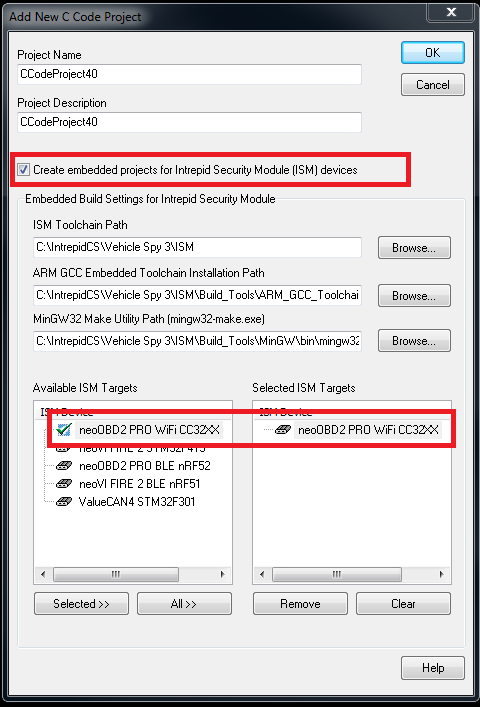

7. Click the **Edit** button from C Code Interface to open the **C Code Module Setup** view.

8. Go to the **Message Events** tab. Select the **Rx Messages** radio button. You should see the **OBDII_RESP** message, double click to add it to the Selected Messages list. Make sure to click the **OK** button to exit the setup.

	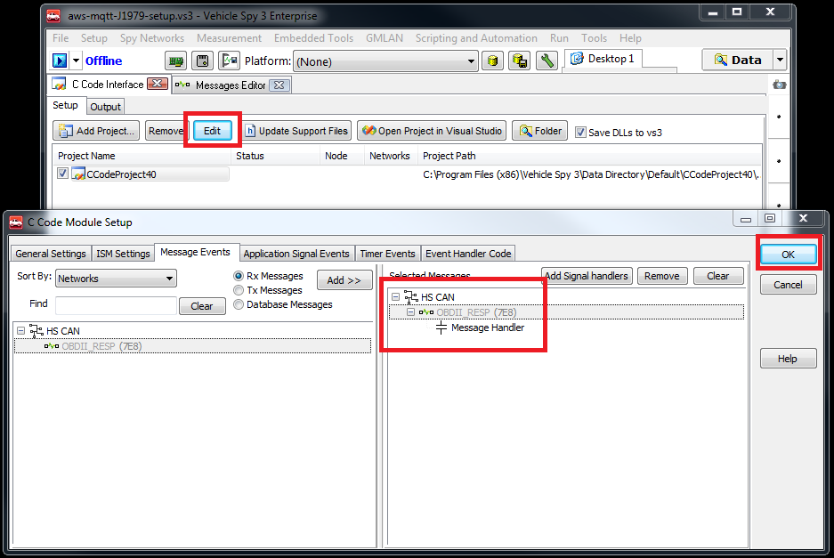

9. Click the **Folder** button from C Code Interface to open the created project directory. Open the **neoOBD2PRO_WIFI_CC32XX** folder. From there, create a new folder with name **Release**.

	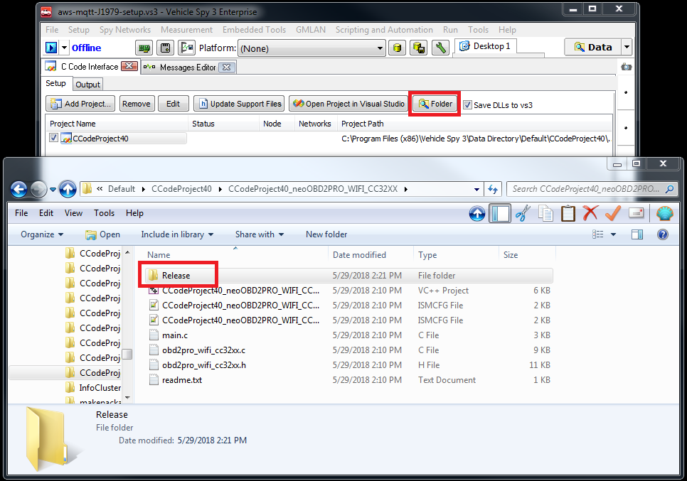

10. Copy and paste the output binary file (.bin) from your CCS project into the **Release** folder.

	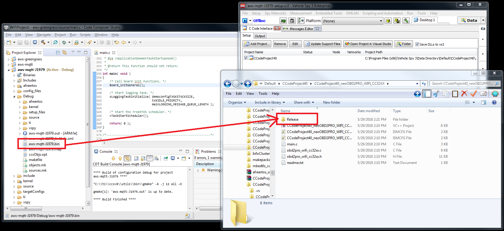

11. Plug-in the neoOBD2 PRO to your laptop via USB Type-A to Type-C cable.

12. Go to **Tools** and select **CoreMini Console** to open the **CoreMini Executable Generator** view.

13. Click the **Clear** button.

	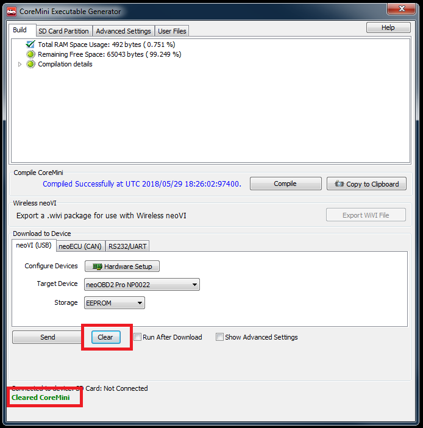

14. Click the **Send** button to program the output binary file into your neoOBD2 PRO. When successfully completed, disconnect your neoOBD2 PRO from PC by removing the USB cable.

	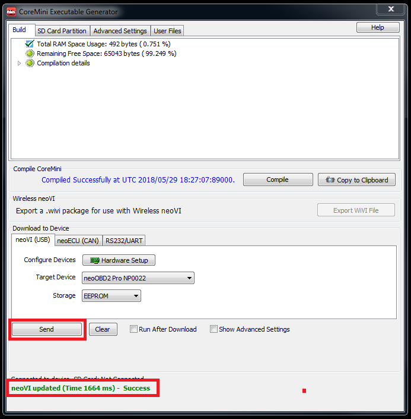

## Running the Application

Connect the neoOBD2 PRO to a OBDII diagnostics port in your car and the sample application will start collecting the OBDII PID data and send them to your AWS IoT broker as configured in the **aws_iot_config** file.

The sample application packs upto 32 4-byte OBDII PIDs into a 132-byte binary payload that is encapsulated in 2-byte header and footer 0xAAAA (2 byte footer + 128 byte data + 2 byte header = 132 byte total).

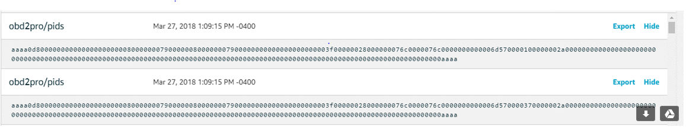

## Troubleshooting

***1. I followed all instructions and programmed my neoOBD2 PRO, but I cannot get it to send any data to my AWS IoT broker.***

First, clear the application by using the **Clear** button from **CoreMini Console** as described in steps 11 - 13 under the **Use Vehicle Spy Professional to Program the Application** section in this guide. Then, try running your CCS application in debug mode. Step through the vApplicationDaemonTaskStartupHook() implementation to see if your program is able to initialize the Wi-Fi module properly and connect to a Wi-Fi Access Point properly. Also check the ParseConfigFile() to see if your program is able to read the necessary credentials correctly from your **aws_iot_config** file.

***2. My application is able to connect to Wi-Fi, but fails to connect to AWS IoT MQTT broker.***

If your program is able to fully execute vApplicationDaemonTaskStartupHook() and can start the application tasks, check the prvCreateClientAndConnectToBroker() implementation to see if MQTT_AGENT_Connect() is failing. If this is the case, it is highly likely your certificate and or policy in AWS IoT are not set up properly. Check to make sure you are using the correct certificate and also your policy is set up properly. Refer to the **[Getting Started with Amazon FreeRTOS](https://docs.aws.amazon.com/freertos/latest/userguide/freertos-prereqs.html)** guide for step-by-step instructions on setting up an IoT thing, private key, certificate, and policy.

***3. My neoOBD2 PRO seems to be sending OBDII PID data to my AWS IoT broker, but the data is all blank (all zeros).***

The sample application packs upto 32 4-byte OBDII PIDs into a 132-byte binary payload that is encapsulated in 2-byte header and footer 0xAAAA (2 byte footer + 128 byte data + 2 byte header = 132 byte total). If you see nothing but 128 bytes of zeros, that can mean two things:

1) Your neoOBD2 PRO is not running the application properly.

2) Your vehicle is not responding to the requests for OBDII data made by neoOBD2 PRO.

In any case, you can use Vehicle Spy Professional to see if your neoOBD2 PRO is properly requesting OBDII data from your car, and your car is actually responding to those requests with legitimate data. First, connect your neoOBD2 PRO to the diagnostics port. Then, use the provided Dual Type-A to Type-C cable to connect the neoOBD2 PRO to your PC. Finally, open Vehicle Spy Professional on your PC and go online to monitor traffic from the Messages view.
